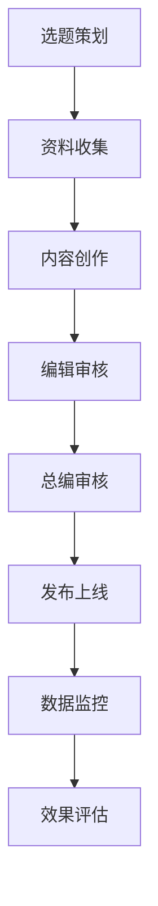
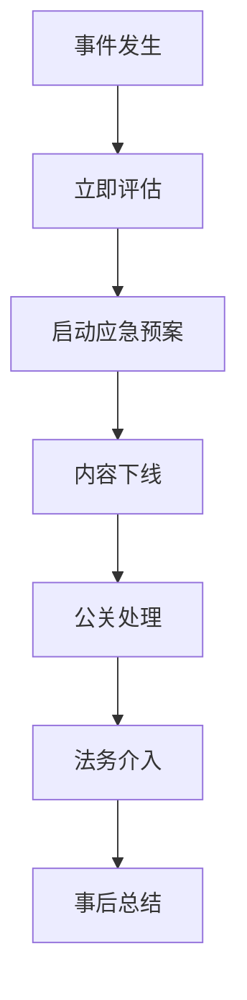

# 🔥 火鸟门户运营管理完整指南

> **传媒集团运营总监版** | 基于火鸟门户官方技术文档  
> 📅 创建时间：2024年12月  
> 🔄 最后更新：2025年01月  
> 🎯 目标：构建专业化新闻资讯门户运营体系

## 📝 更新记录
- [2025-01-20] 整合系统配置运营、自媒体内容采集策略和新闻栏目分类设计
- [2024-12-XX] 初始版本创建

---

## 📋 目录

1. [系统概述](#系统概述)
2. [技术架构配置](#技术架构配置)
3. [新闻栏目分类体系](#新闻栏目分类体系)
4. [自媒体内容采集策略](#自媒体内容采集策略)
5. [内容管理策略](#内容管理策略)
6. [运营管理体系](#运营管理体系)
7. [技术运维保障](#技术运维保障)
8. [数据分析与优化](#数据分析与优化)
9. [风险控制与合规](#风险控制与合规)

---

## 🎯 系统概述

### 火鸟门户系统特色

**核心优势**：
- ✅ 完整的CMS内容管理系统
- ✅ 多终端适配（PC/移动端）
- ✅ 强大的API接口支持
- ✅ 灵活的模板系统
- ✅ 完善的用户权限管理
- ✅ 丰富的插件扩展能力

**技术栈**：
- **后端**：PHP + MySQL
- **前端**：HTML5 + CSS3 + JavaScript
- **服务器**：支持Linux/Windows多平台
- **数据库**：MySQL 5.5+
- **Web服务器**：Apache/Nginx/IIS

---

## 🔧 技术架构配置

### 1. 服务器环境部署

#### Linux环境（推荐）

**CentOS 7.4+ 配置**：
```bash
# 宝塔面板安装（推荐）
yum install -y wget && wget -O install.sh http://download.bt.cn/install/install_6.0.sh && sh install.sh

# 环境配置
- PHP 7.4+
- MySQL 5.6+
- Nginx 1.18+
```

**Ubuntu环境配置**：
```bash
# LAMP环境安装
sudo apt-get update
sudo apt-get install apache2 mysql-server php7.4
```

#### Windows环境

**IIS + PHP + MySQL配置**：
- IIS 7.5+
- PHP 5.6+ / 7.4+
- MySQL 5.6+
- 配置伪静态支持

### 2. 数据库配置

#### MySQL优化配置

```sql
-- 数据库创建
CREATE DATABASE firebird_portal CHARACTER SET utf8mb4 COLLATE utf8mb4_unicode_ci;

-- 用户权限配置
CREATE USER 'firebird_user'@'localhost' IDENTIFIED BY 'secure_password';
GRANT ALL PRIVILEGES ON firebird_portal.* TO 'firebird_user'@'localhost';
FLUSH PRIVILEGES;
```

**性能优化参数**：
```ini
# my.cnf 配置
[mysqld]
innodb_buffer_pool_size = 1G
max_connections = 500
query_cache_size = 64M
tmp_table_size = 64M
max_heap_table_size = 64M
```

### 3. PHP配置优化

```ini
# php.ini 关键配置
memory_limit = 256M
max_execution_time = 300
max_input_vars = 3000
upload_max_filesize = 100M
post_max_size = 100M

# 扩展支持
extension=gd
extension=curl
extension=zip
extension=mysqli
```

---

## 📰 新闻栏目分类体系

### 设计理念
**分类原则**：热点优先 + 地域聚焦 + 深度专业 + 用户粘性

### 🎯 头条板块（一级栏目）

#### 1. 🇺🇸 美国头条 (ID: 10)
**栏目定位**：美国本土重大新闻及全球影响力事件
- **美国政治** (ID: 101) - 白宫动态、国会、最高法院、州政府、选举
- **美国财经** (ID: 102) - 华尔街、美联储、科技股、经济政策、就业数据
- **美国社会** (ID: 103) - 社会热点、枪击案件、种族问题、教育医疗
- **美国科技** (ID: 104) - 硅谷巨头、AI革命、太空探索、生物科技
- **美国娱乐** (ID: 105) - 好莱坞、奥斯卡、超级碗、流行文化
- **美国体育** (ID: 106) - NBA、NFL、MLB、奥运会、大学体育
- **美国军事** (ID: 107) - 五角大楼、军事行动、国防预算、军工企业

#### 2. 🇨🇳 中国今日头条 (ID: 20)
**栏目定位**：大中华区综合新闻（含大陆、台湾、香港）
- **中国政治** (ID: 201) - 中央政府、两会、外交政策、一带一路
- **中国财经** (ID: 202) - A股港股、人民币汇率、央行政策、产业升级
- **中国社会** (ID: 203) - 社会热点、民生政策、教育改革、文化传承
- **中国科技** (ID: 204) - 互联网巨头、新能源车、芯片产业、航天科技
- **中国娱乐** (ID: 205) - 内地港台娱乐、影视剧、综艺节目、明星动态
- **中国体育** (ID: 206) - CBA、中超、乒乓球、奥运备战、体育产业
- **两岸三地** (ID: 207) - 两岸关系、港澳事务、统一话题、文化交流

#### 3. 🏝️ 夏威夷州新闻 (ID: 30)
**栏目定位**：夏威夷本地新闻及太平洋地区资讯
- **本地政治** (ID: 301) - 州长办公室、州议会、市政府、政策法规
- **本地经济** (ID: 302) - 旅游业、房地产、农业、渔业、可再生能源
- **社会生活** (ID: 303) - 社区活动、教育系统、医疗健康、文化节庆
- **旅游资讯** (ID: 304) - 景点推荐、酒店餐饮、活动指南、交通出行
- **环境保护** (ID: 305) - 海洋保护、气候变化、火山监测、生态保育
- **太平洋事务** (ID: 306) - 太平洋岛国、军事基地、国际合作

### 🌐 国际关系板块（二级栏目）

#### 4. 🤝 中美关系 (ID: 40)
**栏目定位**：中美双边关系及全球影响
- **政治外交** (ID: 401) - 高层会晤、外交政策、国际协议、制裁措施
- **经贸往来** (ID: 402) - 贸易战、关税政策、投资限制、供应链重构
- **科技竞争** (ID: 403) - 芯片战、AI竞赛、技术封锁、标准之争
- **军事安全** (ID: 404) - 南海问题、台海局势、军备竞赛、网络安全
- **文化交流** (ID: 405) - 留学教育、人文交流、媒体报道、民间往来

#### 5. 📊 政策解读 (ID: 50)
**栏目定位**：重大政策深度解读及影响分析
- **美国政策** (ID: 501) - 联邦政策、州政策、监管变化、法律修订
- **中国政策** (ID: 502) - 中央政策、地方政策、改革开放、民生政策
- **国际政策** (ID: 503) - 国际组织、多边协议、制裁政策、援助计划
- **经济政策** (ID: 504) - 货币政策、财政政策、产业政策、贸易政策
- **社会政策** (ID: 505) - 移民政策、教育政策、医疗政策、环保政策

### 💼 专业资讯板块（三级栏目）

#### 6. 💰 财经资讯 (ID: 60)
**栏目定位**：全球财经动态及投资理财
- **股市行情** (ID: 601) - 美股、A股、港股、全球指数、个股分析
- **外汇市场** (ID: 602) - 美元指数、人民币汇率、主要货币对、央行政策
- **数字货币** (ID: 603) - 比特币、以太坊、央行数字货币、监管动态
- **投资理财** (ID: 604) - 基金、保险、债券、理财产品、投资策略
- **房地产** (ID: 605) - 美国房市、中国楼市、商业地产、政策影响
- **企业财报** (ID: 606) - 上市公司、财报分析、并购重组、IPO动态

#### 7. 🎭 娱乐资讯 (ID: 70)
**栏目定位**：全球娱乐文化及流行趋势
- **影视娱乐** (ID: 701) - 好莱坞、华语影视、流媒体、票房分析
- **明星动态** (ID: 702) - 欧美明星、华语明星、时尚潮流、社交媒体
- **音乐文化** (ID: 703) - 流行音乐、演唱会、音乐节、排行榜
- **网络文化** (ID: 704) - 网红经济、直播带货、短视频、社交平台
- **游戏电竞** (ID: 705) - 游戏产业、电竞赛事、手游市场、元宇宙
- **文化艺术** (ID: 706) - 博物馆、艺术展、文学作品、传统文化

#### 8. 🚀 科技前沿 (ID: 80)
**栏目定位**：前沿科技及创新趋势深度报道
- **人工智能** (ID: 801) - ChatGPT、自动驾驶、机器学习、AI伦理
- **芯片半导体** (ID: 802) - 芯片战、台积电、英伟达、国产芯片
- **新能源革命** (ID: 803) - 特斯拉、比亚迪、电池技术、充电桩
- **航空航天** (ID: 804) - SpaceX、中国航天、火星探索、卫星互联网
- **生物科技** (ID: 805) - 基因编辑、新药研发、疫苗技术、精准医疗
- **元宇宙Web3** (ID: 806) - VR/AR、NFT、区块链、数字货币

#### 9. 🌱 生活资讯 (ID: 90)
**栏目定位**：实用生活信息及消费指南
- **健康医疗** (ID: 901) - 疾病防治、养生保健、医院推荐、药品安全
- **教育留学** (ID: 902) - 学区房、留学申请、教育政策、培训机构
- **美食旅游** (ID: 903) - 餐厅评测、旅游攻略、酒店推荐、美食制作
- **购物消费** (ID: 904) - 产品评测、购物指南、优惠信息、消费维权
- **房产汽车** (ID: 905) - 房价走势、购房指南、汽车评测、交通出行
- **法律维权** (ID: 906) - 法律咨询、维权案例、政策解读、律师推荐

---

## 🎯 自媒体内容采集策略

### 设计理念
**采集原则**：多平台覆盖 + 内容质量 + 时效性 + 合规性

### 🎯 核心采集平台矩阵

#### 📱 短视频平台（优先级：⭐⭐⭐⭐⭐）

**1. TikTok（抖音国际版）**
- **采集重点**：美国头条相关、中美关系内容、科技前沿、生活资讯
- **推荐账号类型**：政治评论员、财经分析师、科技博主、生活博主

**2. 抖音（中国版）**
- **采集重点**：中国今日头条、两岸三地、财经资讯、娱乐资讯
- **推荐账号类型**：新闻媒体官方账号、财经KOL、娱乐博主

**3. YouTube Shorts**
- **采集重点**：国际关系、政策解读、科技创新、文化交流

#### 📖 图文社交平台（优先级：⭐⭐⭐⭐）

**4. 小红书（XiaoHongShu）**
- **采集重点**：生活资讯、教育留学、投资理财、时尚娱乐
- **推荐内容类型**：留学生活分享、投资理财经验、美食旅游攻略

**5. 微信公众号**
- **采集重点**：深度分析文章、专业资讯、观点评论
- **推荐公众号类型**：主流媒体、财经媒体、科技媒体、国际关系

**6. Twitter/X**
- **采集重点**：实时新闻、官方声音、热点话题、国际视角

#### 📺 长视频平台（优先级：⭐⭐⭐）

**7. YouTube**
- **采集重点**：新闻频道、财经频道、科技频道、文化频道

**8. 哔哩哔哩（B站）**
- **采集重点**：时事解读、科技数码、财经投资、文化娱乐

#### 🌐 专业平台（优先级：⭐⭐⭐）

**9. LinkedIn**
- **采集重点**：商业资讯、专业观点、投资信息

**10. Reddit**
- **采集重点**：社区讨论、专业板块、本地信息

**11. 知乎**
- **采集重点**：深度问答、热榜话题、专业领域

### 按栏目分类的采集策略

#### 🇺🇸 美国头条采集策略
**主要平台**：Twitter、YouTube、TikTok、Reddit
**采集内容**：
- **政治**：白宫Twitter、国会听证会、选举动态
- **财经**：华尔街日报、Bloomberg、CNBC
- **社会**：CNN、Fox News、本地新闻台
- **科技**：TechCrunch、The Verge、Wired

#### 🇨🇳 中国今日头条采集策略
**主要平台**：微信公众号、抖音、知乎、B站
**采集内容**：
- **政治**：人民日报、新华社、央视新闻
- **财经**：财新网、第一财经、华尔街见闻
- **社会**：澎湃新闻、界面新闻、观察者网
- **科技**：36氪、虎嗅网、钛媒体

#### 🏝️ 夏威夷州新闻采集策略
**主要平台**：本地媒体官网、Facebook、Instagram、YouTube
**采集内容**：
- **本地媒体**：Hawaii News Now、Star Advertiser、Civil Beat
- **政府官方**：州政府官网、市政府社交媒体
- **社区平台**：本地Facebook群组、Reddit r/Hawaii
- **旅游平台**：TripAdvisor、Yelp、旅游博主

#### 🤝 中美关系采集策略
**主要平台**：Twitter、微信公众号、YouTube、LinkedIn
**采集内容**：
- **官方声音**：外交部发言人、白宫声明、大使馆
- **专家观点**：国际关系学者、智库报告、政策分析
- **媒体报道**：中美主流媒体、国际媒体视角
- **民间声音**：双语博主、文化交流、商业合作

### 技术实施方案

#### n8n工作流配置
```json
{
  "platform_configs": {
    "tiktok": {
      "api_endpoint": "TikTok Research API",
      "rate_limit": "100 requests/hour",
      "content_types": ["video", "text", "hashtag"]
    },
    "xiaohongshu": {
      "scraping_method": "web_scraping",
      "rate_limit": "50 requests/hour",
      "content_types": ["note", "image", "video"]
    },
    "wechat_public": {
      "api_endpoint": "WeChat Official API",
      "rate_limit": "200 requests/hour",
      "content_types": ["article", "image", "video"]
    },
    "twitter": {
      "api_endpoint": "Twitter API v2",
      "rate_limit": "300 requests/15min",
      "content_types": ["tweet", "thread", "media"]
    }
  }
}
```

#### 内容分类映射
```json
{
  "category_mapping": {
    "美国头条": {
      "keywords": ["US politics", "White House", "Congress", "Supreme Court"],
      "hashtags": ["#USPolitics", "#America", "#Washington"],
      "accounts": ["@WhiteHouse", "@SpeakerPelosi", "@SenateMajLdr"]
    },
    "中国今日头条": {
      "keywords": ["中国政治", "两会", "一带一路", "改革开放"],
      "hashtags": ["#中国新闻", "#两会", "#一带一路"],
      "accounts": ["人民日报", "新华社", "央视新闻"]
    },
    "中美关系": {
      "keywords": ["China US", "中美关系", "trade war", "贸易战"],
      "hashtags": ["#ChinaUS", "#中美关系", "#TradeWar"],
      "accounts": ["@StateDept", "外交部发言人办公室"]
    }
  }
}
```

---

## 📝 内容管理策略

### 1. 内容生产流程

#### 日常生产流程


**时间节点控制**：
- 🕐 **09:00**：晨会，确定当日重点选题
- 🕐 **12:00**：午间新闻发布
- 🕐 **18:00**：晚间新闻发布
- 🕐 **21:00**：次日选题策划

### 2. 内容审核机制

#### 三级审核体系

**一级：自动审核**
- 关键词过滤
- 重复内容检测
- 格式规范检查

**二级：编辑审核**
- 内容质量评估
- 事实核查
- 版权确认

**三级：总编审核**
- 敏感内容把关
- 重大新闻确认
- 法律风险评估

```php
// 审核状态配置
$audit_status = [
    0 => '待审核',
    1 => '一级通过',
    2 => '二级通过',
    3 => '发布',
    -1 => '审核不通过',
    -2 => '需要修改'
];
```

### 3. 内容质量控制

#### 自动筛选规则
- **关键词匹配**：基于栏目关键词自动分类
- **热度筛选**：点赞、转发、评论数量阈值
- **时效性检查**：发布时间在24小时内
- **重复内容检测**：避免采集重复内容

#### 人工审核流程
- **一级审核**：AI自动审核，过滤违规内容
- **二级审核**：编辑人工审核，确保内容质量
- **三级审核**：栏目总监终审，重要内容把关

#### 合规性检查
- **版权检查**：确保内容使用合规
- **敏感词过滤**：政治敏感、违法违规内容
- **来源标注**：明确标注内容来源和作者

### 4. 内容分发策略

#### 多渠道分发

**主站发布**：
- 首页推荐位
- 分类页面
- 专题聚合

**社交媒体同步**：
- 微信公众号
- 微博官方账号
- Facebook页面
- Twitter账号

**SEO优化**：
```php
// SEO配置
$seo_config = [
    'title_template' => '{title} - 火鸟门户',
    'meta_description' => '{summary}',
    'keywords' => '{tags}',
    'og_image' => '{featured_image}',
    'canonical_url' => '{article_url}'
];
```

---

## 🎯 运营管理体系

### 1. 编辑团队架构

#### 组织架构
```
总编辑
├── 美国新闻主编
│   ├── 政治记者 (2人)
│   ├── 经济记者 (2人)
│   └── 社会记者 (1人)
├── 中国新闻主编
│   ├── 大陆新闻记者 (2人)
│   ├── 港台记者 (1人)
│   └── 财经记者 (1人)
├── 专题策划主编
│   ├── 深度报道记者 (2人)
│   └── 数据分析师 (1人)
└── 技术运营主管
    ├── 前端开发 (1人)
    └── 运维工程师 (1人)
```

### 2. 栏目运营策略

#### 🎯 内容策略
**头条栏目**：
- **美国头条**：重点关注白宫、国会、最高法院重大决策，华尔街财经动态
- **中国今日头条**：聚焦中央政策、两会动态、港澳台事务、经济数据
- **夏威夷州新闻**：本地化深度报道，旅游经济，环保议题

**专题策略**：
- **中美关系**：每日必更，深度分析，专家解读，影响评估
- **政策解读**：政策发布后24小时内推出解读文章
- **财经资讯**：实时行情+深度分析，周末推出投资策略

#### 📈 流量运营
**热点追踪**：
- 建立热点监控系统，第一时间捕捉突发新闻
- 重大事件专题策划，多角度深度报道
- 节假日、重要会议提前策划专题内容

**SEO优化**：
- 关键词布局：每个栏目设置核心关键词矩阵
- 内链建设：相关文章推荐，专题聚合页面
- 外链获取：与权威媒体建立内容合作关系

#### 👥 用户运营
**个性化推荐**：
- 基于用户阅读历史推荐相关栏目内容
- 地域定制：根据用户IP推送本地化内容
- 兴趣标签：用户可订阅感兴趣的栏目和话题

**互动策略**：
- 重大新闻开启评论区，引导理性讨论
- 定期举办线上讨论活动，增强用户粘性
- 建立用户投稿通道，UGC内容补充

### 3. 绩效考核体系

#### KPI指标设定

**内容质量指标**：
- 原创文章比例 ≥ 60%
- 文章平均阅读量 ≥ 1000
- 用户停留时间 ≥ 2分钟
- 分享转发率 ≥ 5%

**时效性指标**：
- 突发新闻响应时间 ≤ 30分钟
- 日常新闻发布及时率 ≥ 95%
- 内容更新频率：每日 ≥ 20篇

**用户互动指标**：
- 评论回复率 ≥ 80%
- 用户投诉处理时间 ≤ 2小时
- 用户满意度 ≥ 85%

---

## 🔧 技术运维保障

### 1. 系统监控配置

#### 服务器监控
```bash
# 宝塔面板监控配置
# CPU使用率告警：> 80%
# 内存使用率告警：> 85%
# 磁盘使用率告警：> 90%
# 网站响应时间告警：> 3秒
```

#### 数据库监控
```sql
-- 慢查询监控
SET GLOBAL slow_query_log = 'ON';
SET GLOBAL long_query_time = 2;
SET GLOBAL slow_query_log_file = '/var/log/mysql/slow.log';

-- 连接数监控
SHOW STATUS LIKE 'Threads_connected';
SHOW STATUS LIKE 'Max_used_connections';
```

### 2. 备份策略

#### 数据备份方案
```bash
#!/bin/bash
# 每日自动备份脚本

# 数据库备份
mysqldump -u backup_user -p firebird_portal > /backup/db_$(date +%Y%m%d).sql

# 文件备份
tar -czf /backup/files_$(date +%Y%m%d).tar.gz /var/www/html/

# 清理7天前的备份
find /backup -name "*.sql" -mtime +7 -delete
find /backup -name "*.tar.gz" -mtime +7 -delete
```

**备份策略**：
- 📅 **每日备份**：数据库 + 重要文件
- 📅 **每周备份**：完整系统备份
- 📅 **每月备份**：异地备份存储
- 📅 **实时备份**：重要配置文件

### 3. 安全防护

#### 安全配置清单

**服务器安全**：
- ✅ 防火墙配置
- ✅ SSH密钥登录
- ✅ 定期安全更新
- ✅ 异常登录监控

**应用安全**：
- ✅ SQL注入防护
- ✅ XSS攻击防护
- ✅ CSRF令牌验证
- ✅ 文件上传限制

**数据安全**：
- ✅ 数据库权限控制
- ✅ 敏感数据加密
- ✅ 访问日志记录
- ✅ 数据备份验证

---

## 📊 数据分析与优化

### 1. 数据统计配置

#### Google Analytics配置
```html
<!-- GA4 配置 -->
<script async src="https://www.googletagmanager.com/gtag/js?id=GA_MEASUREMENT_ID"></script>
<script>
  window.dataLayer = window.dataLayer || [];
  function gtag(){dataLayer.push(arguments);}
  gtag('js', new Date());
  gtag('config', 'GA_MEASUREMENT_ID');
</script>
```

#### 自定义统计指标
```php
// 文章阅读统计
function track_article_view($article_id, $user_ip) {
    $sql = "INSERT INTO article_views (article_id, user_ip, view_time) VALUES (?, ?, NOW())";
    // 执行统计记录
}

// 用户行为统计
function track_user_behavior($action, $target, $user_id = null) {
    $data = [
        'action' => $action,
        'target' => $target,
        'user_id' => $user_id,
        'timestamp' => time(),
        'user_agent' => $_SERVER['HTTP_USER_AGENT'],
        'ip_address' => get_client_ip()
    ];
    // 记录用户行为
}
```

### 2. 数据分析报表

#### 日报数据
- 📈 **流量数据**：PV、UV、跳出率
- 📈 **内容数据**：发布量、阅读量、分享量
- 📈 **用户数据**：新增用户、活跃用户、留存率
- 📈 **收入数据**：广告收入、会员收入

#### 周报分析
- 📊 **热门内容排行**
- 📊 **流量来源分析**
- 📊 **用户画像分析**
- 📊 **竞品对比分析**

#### 月度总结
- 📋 **运营目标达成情况**
- 📋 **内容质量评估**
- 📋 **技术性能报告**
- 📋 **下月优化计划**

### 3. 性能优化策略

#### 前端优化
```javascript
// 图片懒加载
const lazyImages = document.querySelectorAll('img[data-src]');
const imageObserver = new IntersectionObserver((entries, observer) => {
  entries.forEach(entry => {
    if (entry.isIntersecting) {
      const img = entry.target;
      img.src = img.dataset.src;
      img.classList.remove('lazy');
      imageObserver.unobserve(img);
    }
  });
});

lazyImages.forEach(img => imageObserver.observe(img));
```

#### 缓存策略
```php
// Redis缓存配置
$redis_config = [
    'host' => '127.0.0.1',
    'port' => 6379,
    'timeout' => 2.5,
    'prefix' => 'firebird:',
    'cache_time' => [
        'article_list' => 300,    // 5分钟
        'article_detail' => 1800, // 30分钟
        'category_list' => 3600,  // 1小时
        'hot_articles' => 600     // 10分钟
    ]
];
```

### 4. 效果评估指标

#### 流量指标
- **日均PV**：目标 50,000+
- **日均UV**：目标 15,000+
- **页面停留时间**：目标 3分钟+
- **跳出率**：控制在 60% 以下

#### 内容指标
- **日发布量**：20-30篇
- **原创比例**：≥ 60%
- **平均阅读量**：≥ 1,000
- **分享转发率**：≥ 5%

#### 用户指标
- **注册用户增长**：月增长 10%
- **用户活跃度**：DAU/MAU ≥ 20%
- **用户留存率**：7日留存 ≥ 30%
- **评论互动率**：≥ 3%

#### 商业指标
- **广告收入**：月目标 $10,000
- **会员收入**：月目标 $5,000
- **CPM**：≥ $2.0
- **转化率**：≥ 2%

#### 采集效果评估

**数量指标**
- **日均采集量**：目标500-800条优质内容
- **平台覆盖率**：覆盖10+主要平台
- **栏目分布**：各栏目内容比例均衡
- **时效性**：80%内容在2小时内完成采集

**质量指标**
- **用户阅读率**：目标70%以上
- **分享转发率**：目标5%以上
- **评论互动率**：目标3%以上
- **内容原创度**：避免100%重复内容

**商业指标**
- **流量增长**：月增长20%
- **用户停留时间**：提升30%
- **广告点击率**：提升25%
- **会员转化率**：提升15%

---

## ⚖️ 风险控制与合规

### 1. 内容合规管理

#### 敏感词库配置
```php
// 敏感词检测
$sensitive_words = [
    'political' => ['政治敏感词1', '政治敏感词2'],
    'violence' => ['暴力词汇1', '暴力词汇2'],
    'illegal' => ['违法词汇1', '违法词汇2']
];

function content_audit($content) {
    global $sensitive_words;
    foreach ($sensitive_words as $category => $words) {
        foreach ($words as $word) {
            if (strpos($content, $word) !== false) {
                return ['status' => 'blocked', 'reason' => $category];
            }
        }
    }
    return ['status' => 'approved'];
}
```

#### 版权保护机制
- ✅ 原创内容标识
- ✅ 转载来源标注
- ✅ 图片版权检查
- ✅ 侵权投诉处理

### 2. 法律风险防控

#### 免责声明配置
```html
<!-- 网站免责声明 -->
<div class="disclaimer">
  <h3>免责声明</h3>
  <p>本网站所发布的信息仅供参考，不构成投资建议...</p>
  <p>如有侵权，请联系我们及时删除...</p>
</div>
```

#### 用户协议模板
- 📄 **用户注册协议**
- 📄 **隐私政策**
- 📄 **内容使用条款**
- 📄 **广告合作协议**

### 3. 采集风险控制

#### 技术风险
- **API限制**：建立多账号轮换机制
- **反爬虫**：使用代理IP和模拟浏览器
- **数据丢失**：建立备份和恢复机制

#### 法律风险
- **版权问题**：明确标注来源，合理使用
- **隐私保护**：遵守各平台隐私政策
- **内容合规**：建立严格的内容审核机制

#### 运营风险
- **内容质量**：建立多层审核机制
- **时效性**：建立实时监控和预警
- **用户体验**：定期收集用户反馈

### 4. 应急响应预案

#### 突发事件处理流程


**应急联系人**：
- 🚨 **总编辑**：负责内容决策
- 🚨 **法务顾问**：负责法律风险
- 🚨 **技术总监**：负责技术处理
- 🚨 **公关经理**：负责对外沟通

---

## 🚀 未来发展规划

### 1. 短期目标（3个月）

**技术优化**：
- ✅ 完成新闻分类体系上线
- ✅ 优化移动端用户体验
- ✅ 集成自媒体内容采集
- ✅ 建立内容审核机制

**内容建设**：
- ✅ 建立专业编辑团队
- ✅ 制定内容生产标准
- ✅ 开展原创内容创作
- ✅ 建立专家作者网络

**用户增长**：
- ✅ 日均UV达到 10,000
- ✅ 注册用户突破 5,000
- ✅ 社交媒体粉丝 10,000+
- ✅ 建立用户社区

### 2. 中期目标（6个月）

**平台扩展**：
- 🎯 开发移动APP
- 🎯 推出视频新闻
- 🎯 建立直播功能
- 🎯 集成AI内容推荐

**商业化**：
- 🎯 月广告收入 $15,000
- 🎯 推出付费会员服务
- 🎯 开展电商合作
- 🎯 建立品牌合作

**影响力**：
- 🎯 成为华人社区主要新闻源
- 🎯 建立媒体合作网络
- 🎯 参与重要新闻事件报道
- 🎯 获得行业认可

### 3. 长期愿景（1年）

**战略目标**：
- 🌟 成为北美华人首选新闻平台
- 🌟 建立多元化内容生态
- 🌟 实现可持续商业模式
- 🌟 扩展至全球华人市场

**技术创新**：
- 🔮 AI驱动的个性化推荐
- 🔮 区块链内容确权
- 🔮 VR/AR新闻体验
- 🔮 多语言智能翻译

---

## 🎯 实施时间表

### 第一阶段：基础建设（第1-2周）
- 完成新闻分类体系配置
- 建立基础的内容审核流程
- 配置核心平台采集（TikTok、抖音、微信公众号）
- 组建编辑团队并进行培训

### 第二阶段：平台扩展（第3-4周）
- 扩展采集平台覆盖（小红书、Twitter、YouTube）
- 完善内容质量控制机制
- 建立人工审核团队
- 优化SEO和用户体验

### 第三阶段：优化调整（第5-6周）
- 根据运营数据调整策略
- 优化关键词和账号列表
- 提升采集效率和质量
- 建立数据监控和分析体系

### 第四阶段：全面运营（第7-8周）
- 所有功能模块正式运营
- 建立长期运营策略
- 制定商业化计划
- 准备扩展和升级方案

---

## 📞 技术支持与联系

### 官方支持渠道

**技术文档**：
- 📚 官方帮助中心：https://help.kumanyun.com/help-280.html
- 📚 API接口文档：项目内置文档
- 📚 开发者社区：技术交流群

**技术支持**：
- 🔧 **系统部署**：提供完整部署指导
- 🔧 **功能定制**：支持个性化开发
- 🔧 **性能优化**：专业优化建议
- 🔧 **故障排除**：7×24小时技术支持

**培训服务**：
- 👨‍🏫 **管理员培训**：系统管理操作
- 👨‍🏫 **编辑培训**：内容管理使用
- 👨‍🏫 **开发培训**：二次开发指导
- 👨‍🏫 **运营培训**：数据分析与优化

**项目支持**：
- **项目负责人**：运营总监
- **技术支持**：火鸟CMS技术团队 + n8n工作流团队
- **内容团队**：各栏目编辑
- **实施周期**：8周

**联系方式**：
- 技术支持：tech@hawaiihub.net
- 内容合作：content@hawaiihub.net
- 法务咨询：legal@hawaiihub.net
- 商务合作：business@hawaiihub.net

---

## 📋 附录

### A. 常用命令速查

```bash
# 系统状态检查
systemctl status nginx
systemctl status mysql
systemctl status php-fpm

# 日志查看
tail -f /var/log/nginx/access.log
tail -f /var/log/mysql/error.log
tail -f /var/log/php-fpm/error.log

# 性能监控
top
htop
iotop
netstat -tulpn
```

### B. 配置文件模板

#### Nginx配置
```nginx
server {
    listen 80;
    server_name firebird-portal.com;
    root /var/www/html;
    index index.php index.html;
    
    location / {
        try_files $uri $uri/ /index.php?$query_string;
    }
    
    location ~ \.php$ {
        fastcgi_pass 127.0.0.1:9000;
        fastcgi_index index.php;
        fastcgi_param SCRIPT_FILENAME $document_root$fastcgi_script_name;
        include fastcgi_params;
    }
    
    location ~* \.(jpg|jpeg|png|gif|ico|css|js)$ {
        expires 1y;
        add_header Cache-Control "public, immutable";
    }
}
```

### C. 故障排除指南

#### 常见问题解决

**网站无法访问**：
1. 检查服务器状态
2. 检查域名解析
3. 检查防火墙设置
4. 检查Web服务配置

**数据库连接失败**：
1. 检查MySQL服务状态
2. 验证数据库配置
3. 检查用户权限
4. 查看错误日志

**页面加载缓慢**：
1. 检查服务器资源
2. 优化数据库查询
3. 启用缓存机制
4. 压缩静态资源

**内容采集异常**：
1. 检查API配额限制
2. 验证账号权限
3. 检查网络连接
4. 查看n8n工作流日志

---

> **文档维护**：本文档将根据系统更新和运营需求持续更新
> 
> **最后更新**：2025年01月
> 
> **版本**：v2.0 运营管理完整版

---

*🔥 火鸟门户 - 专业的新闻资讯管理系统*