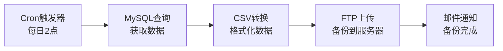
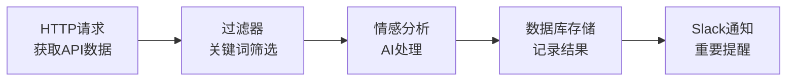
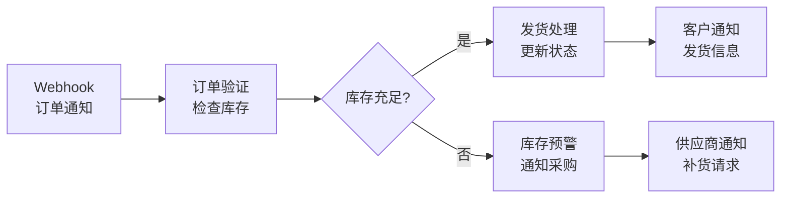

# N8N 快速入门指南

## 🚀 欢迎使用 N8N

N8N是一个强大的工作流自动化工具，让你可以通过可视化界面连接各种服务和API，实现复杂的自动化任务。

---

## 📋 目录

- [系统要求](#系统要求)
- [快速部署](#快速部署)
- [首次登录](#首次登录)
- [创建第一个工作流](#创建第一个工作流)
- [常用节点介绍](#常用节点介绍)
- [实用示例](#实用示例)
- [故障排除](#故障排除)
- [进阶学习](#进阶学习)

---

## 💻 系统要求

### 最低配置
- **CPU**: 2核心
- **内存**: 4GB RAM
- **存储**: 20GB 可用空间
- **操作系统**: Linux / macOS / Windows

### 推荐配置
- **CPU**: 4核心或更多
- **内存**: 8GB RAM 或更多
- **存储**: 50GB SSD
- **网络**: 稳定的互联网连接

### 软件依赖
- Docker 20.10.0+
- Docker Compose 2.0.0+
- Git（可选，用于版本控制）

---

## 🚀 快速部署

### 方法一：使用部署脚本（推荐）

1. **进入项目目录**
   ```bash
   cd N8N学习配置文件夹
   ```

2. **运行部署脚本**
   ```bash
   chmod +x 06-脚本文件/deploy_n8n-学习版-带中文注释.sh
   ./06-脚本文件/deploy_n8n-学习版-带中文注释.sh
   ```

3. **按提示输入配置信息**
   - 域名（开发环境可用localhost）
   - 管理员用户名和密码
   - 其他配置项（可使用默认值）

### 方法二：手动部署

1. **复制配置文件**
   ```bash
   cp 01-Docker配置文件/docker-compose-学习版-带中文注释.yml docker-compose.yml
   cp 02-环境变量配置/.env-学习版-带中文注释 .env
   ```

2. **编辑环境变量**
   ```bash
   nano .env
   ```
   修改以下关键配置：
   - `DOMAIN_NAME`: 你的域名
   - `N8N_BASIC_AUTH_USER`: 管理员用户名
   - `N8N_BASIC_AUTH_PASSWORD`: 管理员密码

3. **启动服务**
   ```bash
   docker-compose up -d
   ```

4. **检查服务状态**
   ```bash
   docker-compose ps
   ```

---

## 🔐 首次登录

### 访问N8N界面

1. **打开浏览器**，访问：
   - 本地部署：`http://localhost:5678`
   - 域名部署：`https://n8n.your-domain.com`

2. **输入登录凭据**
   - 用户名：在.env文件中设置的`N8N_BASIC_AUTH_USER`
   - 密码：在.env文件中设置的`N8N_BASIC_AUTH_PASSWORD`

3. **完成初始设置**
   - 设置管理员账户
   - 配置基本信息
   - 选择使用场景

### 界面介绍

```
┌─────────────────────────────────────────────────────────────┐
│  N8N 工作流编辑器                                              │
├─────────────────────────────────────────────────────────────┤
│ 📁 工作流列表  │  🎨 画布区域        │  ⚙️ 节点配置面板      │
│               │                    │                      │
│ • 我的工作流   │    [开始] ──→ [处理] │  节点名称: HTTP请求   │
│ • 模板库      │      │             │  方法: GET           │
│ • 执行历史    │      ↓             │  URL: https://...    │
│               │    [结束]          │  认证: 无            │
│               │                    │  [测试] [保存]       │
└─────────────────────────────────────────────────────────────┘
```

---

## 🎯 创建第一个工作流

### 示例：定时获取天气信息

#### 步骤1：创建新工作流

1. 点击 **"新建工作流"**
2. 工作流会自动添加一个 **"手动触发"** 节点

#### 步骤2：添加定时触发器

1. **删除手动触发节点**（点击节点，按Delete键）
2. **添加Cron节点**：
   - 点击左侧节点面板的 **"触发器"**
   - 选择 **"Cron"** 节点
   - 拖拽到画布上

3. **配置Cron节点**：
   ```
   节点名称: 每日天气检查
   模式: 每天
   时间: 08:00
   时区: Asia/Shanghai
   ```

#### 步骤3：添加HTTP请求节点

1. **添加HTTP Request节点**：
   - 从节点面板选择 **"HTTP Request"**
   - 连接到Cron节点

2. **配置HTTP请求**：
   ```
   节点名称: 获取天气数据
   方法: GET
   URL: https://api.openweathermap.org/data/2.5/weather
   查询参数:
     - q: Beijing
     - appid: YOUR_API_KEY
     - units: metric
     - lang: zh_cn
   ```

#### 步骤4：添加数据处理节点

1. **添加Set节点**：
   - 用于处理和格式化天气数据
   - 连接到HTTP Request节点

2. **配置Set节点**：
   ```javascript
   // 提取关键天气信息
   return [
     {
       json: {
         城市: $json.name,
         温度: $json.main.temp + '°C',
         天气: $json.weather[0].description,
         湿度: $json.main.humidity + '%',
         时间: new Date().toLocaleString('zh-CN')
       }
     }
   ];
   ```

#### 步骤5：添加通知节点

1. **添加邮件通知**（可选）：
   - 选择 **"Email Send"** 节点
   - 配置SMTP服务器信息

2. **或添加Webhook**：
   - 选择 **"HTTP Request"** 节点
   - 发送到企业微信/钉钉等

#### 步骤6：测试和保存

1. **测试工作流**：
   - 点击 **"执行工作流"** 按钮
   - 查看每个节点的执行结果

2. **保存工作流**：
   - 点击 **"保存"** 按钮
   - 输入工作流名称：**"每日天气通知"**

3. **激活工作流**：
   - 点击右上角的 **"激活"** 开关
   - 工作流将按计划自动执行

---

## 🧩 常用节点介绍

### 触发器节点

| 节点名称 | 功能描述 | 使用场景 |
|---------|---------|---------|
| **Manual Trigger** | 手动触发 | 测试、一次性任务 |
| **Cron** | 定时触发 | 定期任务、报告生成 |
| **Webhook** | HTTP触发 | API集成、外部系统调用 |
| **Email Trigger** | 邮件触发 | 邮件处理、自动回复 |
| **File Trigger** | 文件监控 | 文件处理、数据同步 |

### 核心节点

| 节点名称 | 功能描述 | 使用场景 |
|---------|---------|---------|
| **HTTP Request** | HTTP请求 | API调用、数据获取 |
| **Set** | 数据设置 | 数据转换、变量设置 |
| **Code** | 代码执行 | 复杂逻辑、数据处理 |
| **IF** | 条件判断 | 流程控制、条件分支 |
| **Switch** | 多条件分支 | 复杂条件判断 |
| **Merge** | 数据合并 | 多数据源合并 |

### 应用节点

| 节点名称 | 功能描述 | 使用场景 |
|---------|---------|---------|
| **Gmail** | Gmail操作 | 邮件发送、邮件处理 |
| **Slack** | Slack集成 | 团队通知、消息发送 |
| **Google Sheets** | 表格操作 | 数据记录、报表生成 |
| **MySQL** | 数据库操作 | 数据存储、查询 |
| **FTP** | 文件传输 | 文件上传、下载 |

---

## 💡 实用示例

### 示例1：自动化数据备份



**配置要点**：
- Cron: `0 2 * * *`（每日凌晨2点）
- MySQL: 查询需要备份的表
- CSV: 将数据转换为CSV格式
- FTP: 上传到备份服务器
- Email: 发送备份完成通知

### 示例2：社交媒体监控



**配置要点**：
- HTTP Request: 调用社交媒体API
- IF节点: 筛选包含关键词的内容
- OpenAI: 进行情感分析
- MySQL: 存储分析结果
- Slack: 发送重要提醒

### 示例3：电商订单处理



**配置要点**：
- Webhook: 接收订单系统通知
- HTTP Request: 查询库存系统
- IF节点: 判断库存是否充足
- 多个分支处理不同情况
- 邮件/短信通知相关人员

---

## 🔧 故障排除

### 常见问题

#### 1. 无法访问N8N界面

**症状**：浏览器显示"无法连接"

**解决方案**：
```bash
# 检查容器状态
docker-compose ps

# 查看日志
docker-compose logs n8n

# 重启服务
docker-compose restart n8n
```

#### 2. 工作流执行失败

**症状**：节点显示红色错误标记

**解决方案**：
1. **查看错误详情**：点击节点查看错误信息
2. **检查配置**：验证API密钥、URL等配置
3. **测试连接**：使用"测试步骤"功能
4. **查看日志**：检查系统日志获取详细信息

#### 3. 数据库连接错误

**症状**：N8N启动失败，提示数据库连接错误

**解决方案**：
```bash
# 检查PostgreSQL状态
docker-compose logs postgres

# 重启数据库
docker-compose restart postgres

# 检查环境变量
cat .env | grep POSTGRES
```

#### 4. 内存不足

**症状**：系统运行缓慢，容器重启

**解决方案**：
1. **增加系统内存**
2. **优化工作流**：减少并发执行数量
3. **调整配置**：
   ```bash
   # 在.env文件中调整
   N8N_CONCURRENCY=5
   N8N_PAYLOAD_SIZE_MAX=8
   ```

### 日志查看

#### 查看所有服务日志
```bash
docker-compose logs -f
```

#### 查看特定服务日志
```bash
# N8N服务日志
docker-compose logs -f n8n

# 数据库日志
docker-compose logs -f postgres

# Redis日志
docker-compose logs -f redis
```

#### 查看实时日志
```bash
# 实时跟踪日志
docker-compose logs -f --tail=100 n8n
```

### 性能优化

#### 1. 数据库优化
```sql
-- 连接到PostgreSQL
docker-compose exec postgres psql -U n8n -d n8n

-- 查看慢查询
SELECT query, mean_time, calls 
FROM pg_stat_statements 
ORDER BY mean_time DESC 
LIMIT 10;

-- 分析表统计信息
ANALYZE;
```

#### 2. 清理执行历史
```bash
# 进入N8N容器
docker-compose exec n8n /bin/bash

# 清理30天前的执行记录
n8n execute --file=/usr/local/lib/node_modules/n8n/dist/commands/executionCleanup.js --older-than=30
```

---

## 📚 进阶学习

### 学习路径

#### 初级阶段（1-2周）
1. **基础概念**：
   - 了解工作流、节点、连接的概念
   - 掌握基本的触发器使用
   - 学会使用HTTP Request节点

2. **实践项目**：
   - 创建简单的定时任务
   - 实现基本的API数据获取
   - 设置邮件通知

#### 中级阶段（2-4周）
1. **高级功能**：
   - 学习条件判断和循环
   - 掌握数据转换和处理
   - 了解错误处理机制

2. **集成应用**：
   - 连接常用SaaS服务
   - 实现数据库操作
   - 创建复杂的业务流程

#### 高级阶段（1-2个月）
1. **自定义开发**：
   - 编写自定义节点
   - 使用Code节点实现复杂逻辑
   - 集成第三方API

2. **系统管理**：
   - 性能监控和优化
   - 安全配置和管理
   - 备份和恢复策略

### 学习资源

#### 官方资源
- **官方文档**：https://docs.n8n.io/
- **社区论坛**：https://community.n8n.io/
- **GitHub仓库**：https://github.com/n8n-io/n8n

#### 中文资源
- **中文文档**：本学习文件夹中的各种指南
- **视频教程**：B站搜索"N8N教程"
- **技术博客**：掘金、CSDN等平台的N8N相关文章

#### 实践项目
1. **个人助手**：
   - 天气提醒
   - 日程管理
   - 邮件自动分类

2. **业务自动化**：
   - 客户服务自动化
   - 数据同步和备份
   - 报表自动生成

3. **系统集成**：
   - CRM系统集成
   - 电商平台对接
   - 监控告警系统

### 最佳实践

#### 1. 工作流设计原则
- **单一职责**：每个工作流专注一个业务场景
- **模块化**：将复杂流程拆分为多个子工作流
- **错误处理**：为关键节点添加错误处理逻辑
- **文档化**：为工作流添加清晰的说明和注释

#### 2. 性能优化建议
- **合理设置并发数**：避免过多并发执行
- **优化数据传输**：减少不必要的数据传递
- **使用缓存**：对重复数据进行缓存
- **定期清理**：清理历史执行记录和日志

#### 3. 安全注意事项
- **敏感信息保护**：使用凭据管理功能
- **访问控制**：设置合适的用户权限
- **网络安全**：配置防火墙和SSL证书
- **定期更新**：保持系统和依赖的最新版本

---

## 🎉 总结

恭喜你完成了N8N快速入门指南的学习！现在你应该能够：

✅ **部署N8N系统**：使用Docker快速搭建N8N环境
✅ **创建基础工作流**：掌握节点连接和配置方法
✅ **解决常见问题**：具备基本的故障排除能力
✅ **规划学习路径**：知道如何进一步提升技能

### 下一步建议

1. **实践练习**：尝试创建更多实用的工作流
2. **深入学习**：阅读详细的配置文件说明
3. **社区参与**：加入N8N社区，分享经验和问题
4. **持续改进**：根据实际需求优化和扩展系统

### 获取帮助

如果在使用过程中遇到问题，可以：
- 查看本学习文件夹中的其他指南文档
- 访问N8N官方文档和社区
- 查看系统日志获取详细错误信息
- 在GitHub上提交Issue或寻找解决方案

祝你在自动化的道路上越走越远！🚀

---

*最后更新时间：2024年1月*
*版本：v1.0*