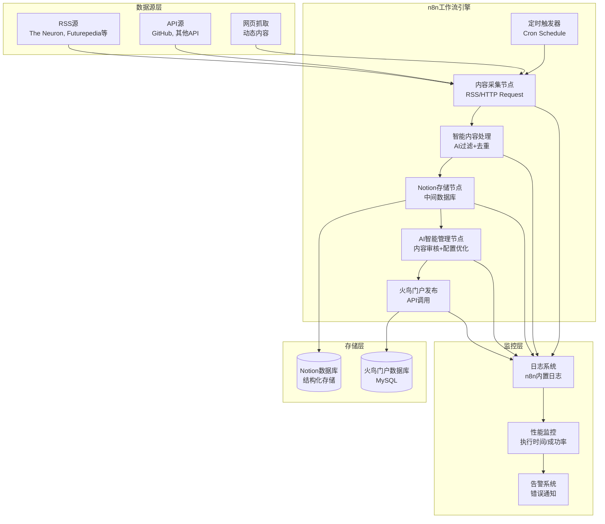
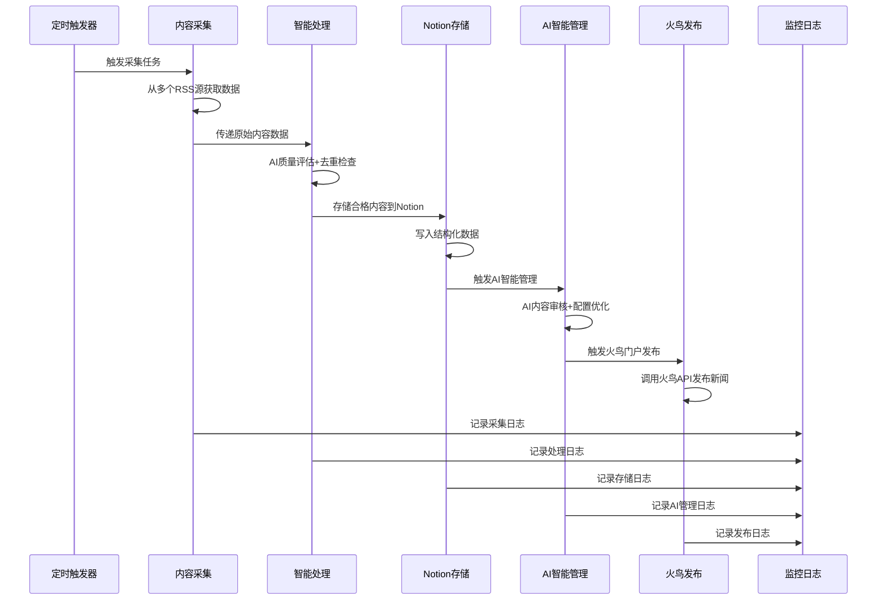

# 自动化新闻工作流设计文档

## 概述

本设计文档基于已批准的需求规格，详细描述了自动化新闻工作流系统的技术架构。系统将最大化复用现有的火鸟门户新闻采集工作流，集成Notion作为中间存储层，实现从多源新闻采集到火鸟门户自动发布的完整流程。

### 设计原则

1. **最大化复用**：基于现有的`火鸟门户_新闻采集工作流_增强版.json`，复用≥95%的功能
2. **渐进式增强**：在现有工作流基础上插入Notion存储节点，不破坏现有数据流
3. **容错设计**：每个环节都有重试机制和错误处理
4. **安全优先**：所有凭据使用n8n加密存储，API调用使用HTTPS
5. **可监控性**：完整的日志记录和性能监控

## 架构设计

### 系统架构图



### 数据流架构



## 组件设计

### 1. 内容采集组件

**基于现有节点**：复用现有工作流中的RSS采集和HTTP请求节点

**功能增强**：

- 支持更多RSS源配置
- 增加GitHub项目新闻源
- 优化错误处理和重试机制

**配置参数**：

```json
{
  "rss_sources": [
    {
      "name": "The Neuron",
      "url": "https://www.theneuron.ai/feed",
      "category": "AI资讯"
    },
    {
      "name": "Futurepedia",
      "url": "https://www.futurepedia.io/rss",
      "category": "AI工具"
    }
  ],
  "collection_interval": "0 */30 * * * *",
  "timeout": 30000,
  "retry_attempts": 3
}
```

### 2. 智能内容处理组件

**基于现有节点**：复用现有的`HuoNiaoContentProcessor`智能处理模块

**核心功能**：

- AI内容相关性评估
- 重复内容检测
- 内容质量评分
- 数据标准化处理

**处理流程**：

```javascript
// 基于现有的智能内容处理逻辑
const processor = new HuoNiaoContentProcessor({
  aiApiKey: process.env.OPENAI_API_KEY,
  enableCache: true,
  enableLogging: true,
  similarityThreshold: 0.8,
  minContentLength: 100,
  maxContentLength: 5000,
});

const result = await processor.processContent(inputData, {
  enableAI: true,
  optimizeTitle: true,
  optimizeContent: true,
  generateKeywords: true,
  generateSummary: true,
});
```

### 3. Notion存储组件

**新增组件**：在现有工作流中插入Notion节点

**数据库结构**：

```json
{
  "database_name": "火鸟门户新闻内容库",
  "properties": {
    // 基础内容字段
    "标题": { "type": "title" },
    "短标题": { "type": "rich_text" },
    "内容": { "type": "rich_text" },
    "摘要": { "type": "rich_text" },

    // 来源信息
    "来源": {
      "type": "select",
      "options": [
        { "name": "The Neuron", "color": "blue" },
        { "name": "Futurepedia", "color": "green" },
        { "name": "Superhuman", "color": "orange" },
        { "name": "The Rundown AI", "color": "purple" },
        { "name": "GitHub项目", "color": "gray" },
        { "name": "API采集", "color": "default" }
      ]
    },
    "作者": { "type": "rich_text" },
    "原始URL": { "type": "url" },
    "来源网址": { "type": "url" },
    "发布日期": { "type": "date" },

    // 分类和标签 (对应火鸟门户分类)
    "分类ID": { "type": "number" },
    "分类名称": {
      "type": "select",
      "options": [
        { "name": "科技资讯", "color": "blue" },
        { "name": "本地新闻", "color": "green" },
        { "name": "生活资讯", "color": "yellow" }
      ]
    },
    "关键词": { "type": "multi_select" },

    // 媒体资源
    "缩略图URL": { "type": "url" },
    "图片集合": { "type": "rich_text" },

    // 状态和质量
    "质量分数": { "type": "number", "format": "number" },
    "处理状态": {
      "type": "select",
      "options": [
        { "name": "待处理", "color": "gray" },
        { "name": "已存储", "color": "blue" },
        { "name": "已发布", "color": "green" },
        { "name": "已拒绝", "color": "red" }
      ]
    },
    "审核状态": {
      "type": "select",
      "options": [
        { "name": "未审核", "color": "gray" },
        { "name": "已审核", "color": "green" },
        { "name": "审核拒绝", "color": "red" }
      ]
    },

    // 显示属性 (对应火鸟门户flag字段)
    "标题颜色": { "type": "rich_text" },
    "附加属性": {
      "type": "multi_select",
      "options": [
        { "name": "头条", "color": "red" },
        { "name": "推荐", "color": "blue" },
        { "name": "加粗", "color": "orange" },
        { "name": "图文", "color": "green" },
        { "name": "跳转", "color": "purple" }
      ]
    },
    "排序权重": { "type": "number" },

    // 系统字段
    "城市ID": { "type": "number" },
    "评论开关": { "type": "checkbox" },
    "跳转地址": { "type": "url" },

    // 火鸟门户专用字段
    "火鸟文章ID": { "type": "number" },
    "阅读次数": { "type": "number" },
    "发布人ID": { "type": "number" },

    // 处理记录
    "错误信息": { "type": "rich_text" },
    "处理时间": { "type": "number" },
    "AI评估结果": { "type": "rich_text" },
    "重复检查结果": { "type": "rich_text" },

    // 时间戳
    "创建时间": { "type": "created_time" },
    "更新时间": { "type": "last_edited_time" }
  }
}
```

**API调用配置**：

```json
{
  "authentication": "notion_oauth2",
  "database_id": "{{$env.NOTION_DATABASE_ID}}",
  "retry_on_fail": true,
  "retry_times": 3,
  "retry_interval": 5000
}
```

### 4. 火鸟门户发布组件

**基于现有节点**：复用现有的火鸟API集成模块

**API配置**：

```json
{
  "endpoint": "https://hawaiihub.net/include/ajax.php",
  "method": "POST",
  "authentication": {
    "type": "cookie",
    "cookie": "PHPSESSID={{$env.HUONIAO_SESSION_ID}}"
  },
  "headers": {
    "Content-Type": "application/x-www-form-urlencoded",
    "User-Agent": "n8n-automation/1.0",
    "Accept": "application/json, text/plain, */*"
  },
  "parameters": {
    "service": "article",
    "action": "put"
  },
  "retry_config": {
    "max_attempts": 3,
    "retry_interval": 5000,
    "retry_on_status": [500, 502, 503, 504],
    "exponential_backoff": true
  },
  "validation": {
    "success_condition": "{{$json.state}} === 100",
    "error_condition": "{{$json.state}} === 200 || {{$json.state}} === 101"
  }
}
```

**完整的n8n HTTP Request节点配置**：

```json
{
  "name": "火鸟门户发布新闻",
  "type": "n8n-nodes-base.httpRequest",
  "parameters": {
    "url": "https://hawaiihub.net/include/ajax.php",
    "authentication": "genericCredentialType",
    "genericAuthType": "httpHeaderAuth",
    "httpMethod": "POST",
    "sendHeaders": true,
    "headerParameters": {
      "parameters": [
        {
          "name": "Content-Type",
          "value": "application/x-www-form-urlencoded"
        },
        {
          "name": "Cookie",
          "value": "PHPSESSID={{$env.HUONIAO_SESSION_ID}}"
        },
        {
          "name": "User-Agent",
          "value": "n8n-automation/1.0"
        }
      ]
    },
    "sendBody": true,
    "contentType": "form-urlencoded",
    "bodyParameters": {
      "parameters": [
        {
          "name": "service",
          "value": "article"
        },
        {
          "name": "action",
          "value": "put"
        },
        {
          "name": "title",
          "value": "={{$json.标题.substring(0, 60)}}"
        },
        {
          "name": "typeid",
          "value": "={{$json.分类ID || 1}}"
        },
        {
          "name": "body",
          "value": "={{$json.内容}}"
        },
        {
          "name": "writer",
          "value": "={{$json.作者 || 'AI采集'}}"
        },
        {
          "name": "source",
          "value": "={{$json.来源 || 'AI采集'}}"
        },
        {
          "name": "sourceurl",
          "value": "={{$json.原始URL || ''}}"
        },
        {
          "name": "keywords",
          "value": "={{$json.关键词 ? $json.关键词.join(',').substring(0, 50) : ''}}"
        },
        {
          "name": "description",
          "value": "={{$json.摘要.substring(0, 255)}}"
        },
        {
          "name": "litpic",
          "value": "={{$json.缩略图URL || ''}}"
        }
      ]
    },
    "options": {
      "timeout": 30000,
      "retry": {
        "enabled": true,
        "maxTries": 3,
        "waitBetweenTries": 5000
      },
      "response": {
        "responseFormat": "json"
      }
    }
  }
}
```

**数据映射**：

```javascript
// 严格按照官方API文档的数据映射
const firebird_data = {
  // 必填字段 - 按照官方API文档
  service: "article",
  action: "put",

  // 新闻内容字段 - 对应huoniao_articlelist表结构
  title: notion_data.标题.substring(0, 60), // char(60) 信息标题
  typeid: 1, // int(5) 分类ID (科技资讯)
  body: notion_data.内容, // text 投稿内容
  writer: notion_data.来源 || "AI采集", // char(20) 作者
  source: notion_data.来源 || "AI采集", // char(30) 来源
  sourceurl: notion_data.原始URL || "", // char(200) 来源网址
  litpic: notion_data.图片URL || "", // char(255) 缩略图
  keywords: notion_data.关键词.join(",").substring(0, 50), // char(50) 关键字
  description: notion_data.摘要.substring(0, 255), // varchar(255) 描述

  // 系统字段 - 按照数据字典规范
  cityid: 1, // smallint(5) 城市ID (夏威夷)
  arcrank: 1, // tinyint(1) 信息状态 (已审核)
  weight: 1, // smallint(4) 排序
  notpost: 0, // tinyint(1) 评论开关 (开启)
  color: "", // char(7) 标题颜色
  flag: "r", // set('h','r','b','p','t') 推荐标记

  // 移动端内容
  mbody: notion_data.内容, // text 手机端内容

  // 可选字段
  subtitle: notion_data.摘要.substring(0, 36), // char(36) 短标题
  redirecturl: "", // varchar(255) 跳转地址

  // 图集处理 (如果有多张图片)
  imglist: notion_data.图片URLs
    ? notion_data.图片URLs.map((url) => `${url}|AI采集图片`).join(",")
    : "",
};
```

### 5. AI智能管理组件

**新增组件**：AI驱动的火鸟门户新闻模块管理节点

**核心功能**：

- 智能内容审核和分类调整
- 自动化新闻模块配置管理
- 基于数据分析的内容优化建议
- 动态调整发布策略和时间

**管理功能模块**：

#### 5.1 智能内容审核

```javascript
// AI内容审核逻辑
const aiContentReview = {
  // 内容质量评估
  qualityAssessment: async (content) => {
    const assessment = await openai.chat.completions.create({
      model: "gpt-4",
      messages: [
        {
          role: "system",
          content:
            "你是火鸟门户的内容审核专家，评估新闻内容的质量、相关性和适合性",
        },
        {
          role: "user",
          content: `请评估以下新闻内容：${content.title}\n${content.body}`,
        },
      ],
    });

    return {
      score: assessment.quality_score,
      category_suggestion: assessment.suggested_category,
      optimization_tips: assessment.improvements,
    };
  },

  // 自动分类建议
  categoryOptimization: async (content) => {
    // 基于内容智能推荐最佳分类
    const categories = await getFirebirdCategories();
    const bestCategory = await aiCategorize(content, categories);
    return bestCategory;
  },
};
```

#### 5.2 动态配置管理

```javascript
// 火鸟门户配置智能管理
const aiConfigManager = {
  // 根据流量和用户行为调整发布策略
  optimizePublishingStrategy: async () => {
    const analytics = await getPortalAnalytics();
    const strategy = await ai.generateStrategy(analytics);

    return {
      optimal_publish_times: strategy.best_times,
      category_priorities: strategy.category_weights,
      content_frequency: strategy.publish_frequency,
    };
  },

  // 自动调整新闻模块设置
  updateModuleSettings: async (optimizations) => {
    const updates = {
      // 热门新闻展示数量
      hot_news_count: optimizations.hot_count,
      // 分类权重调整
      category_weights: optimizations.category_priorities,
      // SEO优化设置
      seo_settings: optimizations.seo_config,
    };

    // 调用火鸟门户配置API
    await updateFirebirdConfig(updates);
  },
};
```

#### 5.3 智能运营建议

```javascript
// AI运营分析和建议
const aiOperationsAdvisor = {
  // 内容表现分析
  analyzeContentPerformance: async () => {
    const metrics = await getContentMetrics();
    const insights = await ai.analyzePerformance(metrics);

    return {
      top_performing_categories: insights.best_categories,
      optimal_content_length: insights.ideal_length,
      engagement_patterns: insights.user_behavior,
      improvement_suggestions: insights.recommendations,
    };
  },

  // 自动化A/B测试
  setupABTests: async (testConfigs) => {
    // 为不同内容策略设置A/B测试
    const tests = await createABTests(testConfigs);
    return tests;
  },
};
```

**API集成配置**：

```json
{
  "ai_management_endpoints": {
    "content_review": "/ai/review",
    "config_optimization": "/ai/optimize-config",
    "performance_analysis": "/ai/analyze",
    "ab_testing": "/ai/ab-test"
  },
  "firebird_management_apis": {
    "get_config": "service=article&action=config",
    "update_config": "service=article&action=update_config",
    "get_analytics": "service=article&action=analytics",
    "manage_categories": "service=article&action=manage_type"
  }
}
```

**工作流集成点**：

- 在内容发布前进行AI审核
- 定期执行配置优化分析
- 基于性能数据动态调整策略
- 自动化运营决策支持

## 数据模型

### 统一数据模型

```typescript
interface NewsItem {
  // 基础信息
  id?: string;
  title: string;
  content: string;
  summary?: string;

  // 来源信息
  source: string;
  source_url?: string;
  author?: string;
  publish_date: string;

  // 分类和标签
  category: string;
  keywords: string[];

  // 媒体资源
  image_url?: string;
  images?: string[];

  // 质量评估
  quality_score?: number;
  relevance_score?: number;

  // 处理状态
  processing_status:
    | "collected"
    | "processed"
    | "stored"
    | "published"
    | "rejected";

  // 时间戳
  created_at: string;
  updated_at: string;

  // 元数据
  metadata: {
    request_id: string;
    processing_time: number;
    error_count: number;
    last_error?: string;
  };
}
```

### Notion数据库映射

```typescript
interface NotionNewsRecord {
  // 基础内容字段
  标题: string; // 对应 title (最大60字符)
  短标题: string; // 对应 subtitle (最大36字符)
  内容: string; // 对应 body/mbody
  摘要: string; // 对应 description (最大255字符)

  // 来源信息
  来源: string; // 对应 source (最大30字符)
  作者: string; // 对应 writer (最大20字符)
  原始URL: string; // 对应 sourceurl (最大200字符)
  发布日期: string; // 对应 pubdate (Unix时间戳)

  // 分类和标签
  分类ID: number; // 对应 typeid
  分类名称: string; // 用于显示
  关键词: string[]; // 对应 keywords (最大50字符，逗号分隔)

  // 媒体资源
  缩略图URL: string; // 对应 litpic (最大255字符)
  图片集合: string[]; // 对应 imglist 处理

  // 状态和质量
  质量分数: number; // AI评估分数
  处理状态: "待处理" | "已存储" | "已发布" | "已拒绝";
  审核状态: number; // 对应 arcrank (0未审核/1已审核/2拒绝)

  // 显示属性
  标题颜色: string; // 对应 color (最大7字符)
  附加属性: string[]; // 对应 flag (h头条/r推荐/b加粗/p图文/t跳转)
  排序权重: number; // 对应 weight

  // 系统字段
  城市ID: number; // 对应 cityid (固定为1-夏威夷)
  评论开关: number; // 对应 notpost (0开启/1关闭)
  跳转地址: string; // 对应 redirecturl

  // 处理记录
  错误信息?: string;
  处理时间: number;
  创建时间: string;
  更新时间: string;
}
```

### 火鸟门户API数据映射

```typescript
// 严格按照官方API文档 1.1.8 发布投稿 接口规范
interface FirebirdAPIPayload {
  // API基础参数
  service: "article"; // 服务名 (必填)
  action: "put"; // 动作名 (发布投稿)

  // 内容字段 (按照官方文档参数)
  title: string; // 信息标题 (必填，最大60字符)
  typeid: number; // 类型ID (必填)
  body: string; // 投稿内容 (必填)
  writer: string; // 作者 (可选，最大20字符)
  source: string; // 来源 (可选，最大30字符)
  keywords: string; // 关键词 (可选，最大50字符)
  description: string; // 描述 (可选，最大255字符)
  litpic?: string; // 缩略图 (可选，加密ID格式)
  imglist?: string; // 图集列表 (可选，格式：图片加密ID|说明，...)

  // 验证码 (如果系统要求)
  vdimgck?: string; // 验证码 (根据系统配置)
}

// 返回数据格式 (按照官方文档)
interface FirebirdAPIResponse {
  state: 100 | 101 | 200; // 状态码：100成功/101错误/200失败
  info: string | number; // 成功时返回信息ID，失败时返回错误信息
}

// 完整的火鸟门户新闻数据结构 (对应huoniao_articlelist表)
interface FirebirdNewsRecord {
  // 主键和基础信息
  id?: number; // mediumint(8) 自增ID
  cityid: number; // smallint(5) 城市ID
  title: string; // char(60) 信息标题
  subtitle?: string; // char(36) 短标题

  // 内容和媒体
  body: string; // 通过huoniao_article表关联存储
  mbody?: string; // text 手机端内容
  litpic?: string; // char(255) 缩略图

  // 分类和属性
  typeid: number; // int(5) 分类ID
  flag?: string; // set('h','r','b','p','t') 附加属性
  weight: number; // smallint(4) 排序

  // 来源信息
  source: string; // char(30) 来源
  sourceurl?: string; // char(200) 来源网址
  writer: string; // char(20) 作者

  // SEO字段
  keywords?: string; // char(50) 关键字
  description?: string; // varchar(255) 描述

  // 状态和控制
  arcrank: 0 | 1 | 2; // tinyint(1) 信息状态 0未审核/1已审核/2拒绝
  notpost: 0 | 1; // tinyint(1) 评论开关 0开启/1关闭
  color?: string; // char(7) 标题颜色
  redirecturl?: string; // varchar(255) 跳转地址

  // 统计字段
  click: number; // int(8) 阅读次数
  pubdate: number; // int(10) 创建时间 Unix时间戳
  admin: number; // int(8) 发布人ID

  // 删除和支付相关
  del: 0 | 1; // tinyint(1) 是否已删除
  waitpay: 0 | 1; // tinyint(1) 等待支付
  alonepay: 0 | 1; // tinyint(1) 单独支付

  // 审核相关
  audit_log?: string; // text 审核记录
  audit_state?: string; // char(20) 审核状态
  audit_edit?: string; // text 审核修改记录

  // 其他功能字段
  reward_switch: 0 | 1; // tinyint(1) 打赏开关
  mold: 0 | 1; // tinyint(1) 类型
  videotype?: 0 | 1; // tinyint(1) 视频类型
  videourl?: string; // varchar(255) 视频地址
  videotime?: number; // smallint(4) 视频时长
  zan: number; // int(6) 赞
  typeset: 0 | 1; // tinyint(1) 排版方式 0小图/1大图
  zhuanti?: number; // int(10) 专题id
  media?: number; // int(10) 媒体号id
  media_state: 0 | 1; // tinyint(1) 自媒体账号状态
  media_arctype?: number; // int(10) 媒体号自定义分类
}
```

## 错误处理策略

### 分层错误处理

1. **采集层错误**：
   - RSS源不可用：跳过该源，继续其他源
   - 网络超时：重试3次，间隔递增
   - 数据格式错误：记录错误，跳过该条目

2. **处理层错误**：
   - AI API调用失败：降级到基础处理逻辑
   - 内容质量不达标：标记为拒绝，记录原因
   - 重复内容检测：跳过处理，记录重复信息

3. **存储层错误**：
   - Notion API失败：指数退避重试，最多3次
   - 数据验证失败：记录详细错误信息
   - 权限问题：立即告警管理员

4. **发布层错误**：
   - 火鸟API调用失败：重试机制，记录详细日志
   - 会话过期：自动刷新或告警
   - 数据映射错误：回滚Notion状态

### 错误恢复机制

```javascript
// 通用重试逻辑
async function retryWithBackoff(operation, maxRetries = 3, baseDelay = 1000) {
  for (let attempt = 1; attempt <= maxRetries; attempt++) {
    try {
      return await operation();
    } catch (error) {
      if (attempt === maxRetries) {
        throw error;
      }

      const delay = baseDelay * Math.pow(2, attempt - 1);
      await new Promise((resolve) => setTimeout(resolve, delay));
    }
  }
}
```

## 测试策略

### 单元测试

1. **内容采集测试**：
   - RSS解析正确性
   - 错误源处理
   - 数据提取完整性

2. **内容处理测试**：
   - AI评估准确性
   - 去重算法效果
   - 数据标准化正确性

3. **存储测试**：
   - Notion API调用
   - 数据映射正确性
   - 错误处理机制

4. **发布测试**：
   - 火鸟API集成
   - 数据格式转换
   - 状态更新机制

### 集成测试

1. **端到端流程测试**：
   - 完整工作流执行
   - 数据一致性验证
   - 性能基准测试

2. **错误场景测试**：
   - 网络中断恢复
   - API限流处理
   - 数据损坏处理

### 性能测试

1. **负载测试**：
   - 大批量新闻处理
   - 并发请求处理
   - 内存使用优化

2. **压力测试**：
   - 极限数据量处理
   - 长时间运行稳定性
   - 资源泄漏检测

## 部署配置

### n8n环境配置

基于现有的`docker-compose-n8n.yml`配置：

```yaml
# 新增环境变量
environment:
  # Notion集成
  NOTION_API_TOKEN: ${NOTION_API_TOKEN}
  NOTION_DATABASE_ID: ${NOTION_DATABASE_ID}

  # 火鸟门户集成
  HUONIAO_SESSION_ID: ${HUONIAO_SESSION_ID}
  HUONIAO_API_ENDPOINT: https://hawaiihub.net/include/ajax.php

  # AI服务
  OPENAI_API_KEY: ${OPENAI_API_KEY}

  # 监控配置
  WEBHOOK_ALERT_URL: ${WEBHOOK_ALERT_URL}
```

### 工作流部署

1. **导入现有工作流**：

   ```bash
   # 复制现有工作流文件
   cp 火鸟门户_新闻采集工作流_增强版.json workflows/
   ```

2. **添加Notion节点**：
   - 在智能处理节点后插入Notion存储节点
   - 配置数据库连接和字段映射
   - 设置错误处理和重试逻辑

3. **更新火鸟发布节点**：
   - 修改触发条件为Notion存储成功
   - 更新数据源为Notion记录
   - 保持现有的API调用逻辑

### 监控配置

```json
{
  "monitoring": {
    "metrics": {
      "collection_success_rate": ">= 95%",
      "processing_time": "<= 5 minutes",
      "publication_success_rate": ">= 98%",
      "system_uptime": ">= 99.5%"
    },
    "alerts": {
      "error_rate_threshold": "2%",
      "response_time_threshold": "5 minutes",
      "credential_expiry_warning": "7 days"
    }
  }
}
```

## 安全考虑

### 凭据管理

1. **n8n凭据系统**：
   - 所有API密钥使用n8n内置加密存储
   - 定期轮换Notion API令牌
   - 监控火鸟门户会话有效性

2. **网络安全**：
   - 所有外部API调用强制HTTPS
   - 实施请求签名验证
   - 设置合理的超时和重试限制

3. **数据保护**：
   - 敏感信息不记录在日志中
   - 实施数据脱敏处理
   - 定期清理临时数据

### 访问控制

1. **API访问限制**：
   - 基于IP白名单的访问控制
   - API密钥权限最小化原则
   - 实施速率限制

2. **系统权限**：
   - n8n用户权限分离
   - 数据库访问权限控制
   - 日志访问权限管理

## 维护和运维

### 日常维护

1. **性能监控**：
   - 工作流执行时间监控
   - 资源使用情况跟踪
   - 错误率趋势分析

2. **数据维护**：
   - 定期清理过期日志
   - Notion数据库容量管理
   - 重复数据清理

3. **系统更新**：
   - n8n版本更新策略
   - 依赖包安全更新
   - 工作流优化迭代

### 故障处理

1. **故障检测**：
   - 自动化健康检查
   - 异常模式识别
   - 实时告警机制

2. **故障恢复**：
   - 自动重启机制
   - 数据恢复程序
   - 回滚操作流程

3. **故障分析**：
   - 详细错误日志分析
   - 性能瓶颈识别
   - 改进建议生成
