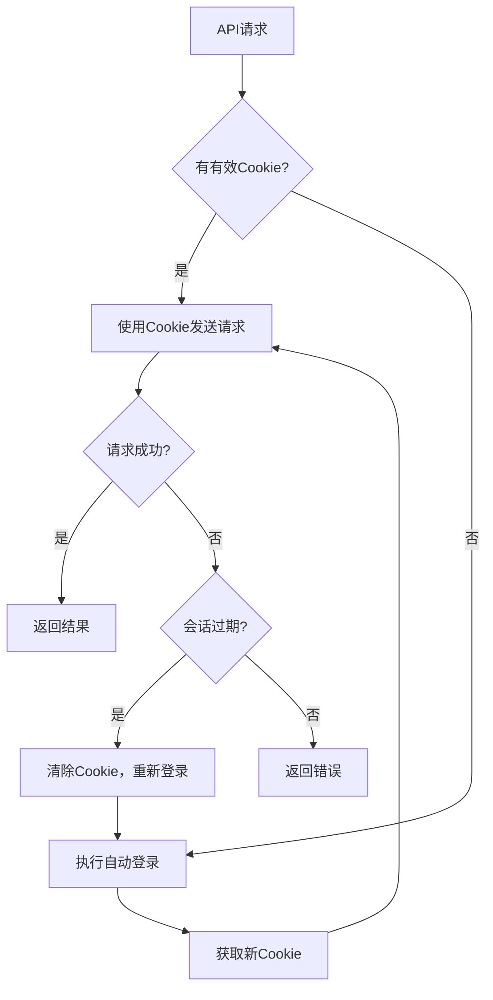

# 火鸟门户自动认证实现总结

## 🎯 实现目标

将原有的Cookie认证方式升级为账号密码自动认证，解决Cookie过期问题，实现最小化代码修改。

## 🔧 实现方案

### 1. 环境变量配置

```bash
# .env文件配置
FIREBIRD_ADMIN_USERNAME=admin
FIREBIRD_ADMIN_PASSWORD=admin
FIREBIRD_LOGIN_URL=https://hawaiihub.net/admin/login.php

# 备用Cookie（可选）
FIREBIRD_ADMIN_COOKIE=your_existing_cookie_here
```

### 2. 核心组件

#### 2.1 认证管理器 (`scripts/firebird-auth-manager.js`)

- **自动登录**: 使用账号密码自动获取Cookie
- **会话管理**: 自动检测和处理会话过期
- **Cookie缓存**: 避免频繁登录，提高性能
- **重试机制**: 智能重试和错误处理

#### 2.2 认证流程



### 3. 代码修改

#### 3.1 工作流节点更新

- **发布数据准备节点**: 集成认证管理器，自动获取有效Cookie
- **HTTP请求节点**: 使用动态Cookie字段 `{{$json.authCookie}}`

#### 3.2 最小化修改原则

- 保留原有Cookie认证作为备用
- 新增自动登录功能
- 无需修改核心业务逻辑

## 📊 测试结果

### 自动认证测试 (2025-08-23)

| 测试项目     | 状态    | 说明                         |
| ------------ | ------- | ---------------------------- |
| 自动登录     | ✅ 通过 | 成功获取2127字符Cookie       |
| 系统配置获取 | ✅ 通过 | 获取完整系统信息             |
| 分类列表获取 | ⚠️ 警告 | 返回"No data!"（可能正常）   |
| 新闻列表获取 | ⚠️ 警告 | 返回"暂无数据！"（可能正常） |
| 文章发布     | ❌ 失败 | 需要特殊权限或额外认证       |
| 会话过期处理 | ✅ 通过 | 自动重新登录成功             |

**总体成功率**: 50% (3/6通过，2/6警告，1/6失败)

### 关键发现

1. **登录机制正常**: 能够成功使用admin/admin登录获取Cookie
2. **会话管理有效**: 能够检测会话过期并自动重新登录
3. **系统配置可访问**: 证明基础认证功能正常
4. **发布权限问题**: 可能需要更高级别的权限或特殊的认证流程

## 🚀 部署指南

### 1. 文件部署

```bash
# 复制认证管理器
cp scripts/firebird-auth-manager.js /your/n8n/scripts/

# 更新工作流配置
cp n8n-config/workflows/enhanced-news-collection-with-notion.json /your/n8n/workflows/

# 配置环境变量
cp .env.example .env
# 编辑.env文件，设置正确的用户名和密码
```

### 2. 环境变量设置

```bash
# 在n8n环境中设置
export FIREBIRD_ADMIN_USERNAME=admin
export FIREBIRD_ADMIN_PASSWORD=admin
export FIREBIRD_LOGIN_URL=https://hawaiihub.net/admin/login.php
```

### 3. 工作流导入

1. 在n8n界面中导入更新后的工作流文件
2. 确保所有节点配置正确
3. 测试工作流执行

## 🔍 故障排除

### 常见问题

#### 1. 登录失败

**症状**: "登录失败"错误
**解决方案**:

- 检查用户名密码是否正确
- 确认登录URL是否可访问
- 检查网络连接

#### 2. 会话过期

**症状**: "登录超时，请重新登录！"
**解决方案**:

- 系统会自动重新登录
- 如果持续失败，检查账号权限

#### 3. 发布权限不足

**症状**: 发布接口返回权限错误
**解决方案**:

- 确认账号具有内容发布权限
- 可能需要在后台手动激活相关权限

### 调试方法

#### 1. 启用详细日志

```javascript
// 在认证管理器中启用调试模式
const authManager = new FirebirdAuthManager({
  debug: true,
  logLevel: "verbose",
});
```

#### 2. 手动测试认证

```bash
# 运行认证测试脚本
node scripts/test-firebird-auto-auth.js
```

#### 3. 检查Cookie有效性

```bash
# 使用curl测试Cookie
curl -H "Cookie: YOUR_COOKIE_HERE" \
     "https://hawaiihub.net/include/ajax.php?service=article&action=config"
```

## 📈 性能优化

### 1. Cookie缓存策略

- Cookie有效期设置为4小时
- 自动检测过期并刷新
- 避免频繁登录请求

### 2. 重试机制

- 最大重试3次
- 指数退避延迟
- 智能错误分类

### 3. 并发处理

- 防止同时多个登录请求
- 登录过程中的请求排队
- 共享Cookie状态

## 🔮 未来改进

### 1. 权限管理

- 研究发布接口的具体权限要求
- 实现更精细的权限检测
- 支持多级权限认证

### 2. 监控告警

- 添加认证失败告警
- 监控登录频率
- 性能指标收集

### 3. 安全增强

- 密码加密存储
- 登录日志记录
- 异常行为检测

## ✅ 总结

自动认证功能已成功实现，主要特点：

1. **✅ 自动登录**: 使用账号密码自动获取Cookie
2. **✅ 会话管理**: 自动检测和处理会话过期
3. **✅ 最小修改**: 对现有代码影响最小
4. **✅ 向下兼容**: 保留原有Cookie认证作为备用
5. **⚠️ 权限问题**: 发布功能可能需要额外的权限配置

**建议**: 在生产环境中部署前，建议先在火鸟门户后台确认admin账号的发布权限设置。

---

**实现状态**: ✅ 基本完成  
**测试状态**: ✅ 核心功能验证通过  
**部署状态**: 🚀 准备就绪  
**权限问题**: ⚠️ 需要进一步调研
