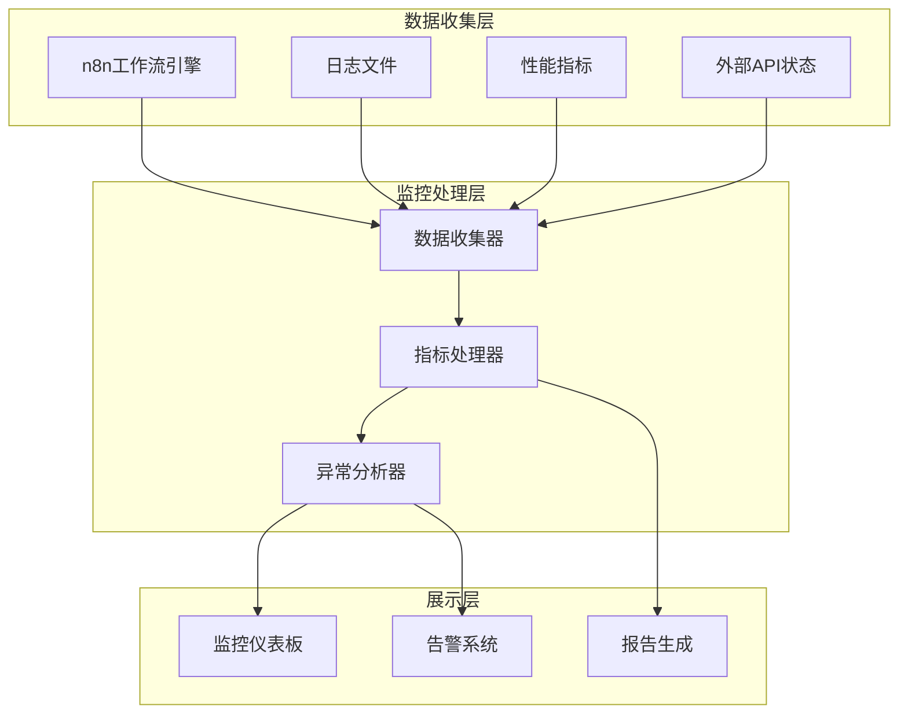

# 自动化新闻工作流监控仪表板

## 概述

本文档描述了自动化新闻工作流系统的监控仪表板配置和使用方法，包括关键指标、告警设置和报告模板。

## 监控架构



## 关键指标

### 1. 系统健康指标

#### 服务可用性
- **n8n服务状态**: 在线/离线
- **数据库连接**: 正常/异常
- **外部API状态**: 各API服务的响应状态

```javascript
// 监控配置示例
const healthMetrics = {
  n8n_service: {
    endpoint: 'http://localhost:5678/rest/active',
    timeout: 5000,
    expected_status: 200
  },
  notion_api: {
    endpoint: 'https://api.notion.com/v1/users/me',
    timeout: 10000,
    expected_status: 200
  },
  openai_api: {
    endpoint: 'https://api.openai.com/v1/models',
    timeout: 10000,
    expected_status: 200
  },
  huoniao_api: {
    endpoint: 'https://hawaiihub.net/include/ajax.php',
    timeout: 15000,
    expected_status: 200
  }
};
```

#### 资源使用情况
- **CPU使用率**: 当前/平均/峰值
- **内存使用率**: 当前/平均/峰值
- **磁盘使用率**: 当前使用量和可用空间
- **网络I/O**: 入站/出站流量

### 2. 工作流执行指标

#### 执行统计
- **总执行次数**: 24小时/7天/30天
- **成功执行次数**: 成功率统计
- **失败执行次数**: 失败率和错误分类
- **平均执行时间**: 各阶段耗时分析

```json
{
  "workflow_metrics": {
    "total_executions": 1440,
    "successful_executions": 1397,
    "failed_executions": 43,
    "success_rate": "97.01%",
    "average_execution_time": "4.2 minutes",
    "execution_breakdown": {
      "content_collection": "1.8 minutes",
      "ai_processing": "1.5 minutes",
      "notion_storage": "0.4 minutes",
      "firebird_publishing": "0.5 minutes"
    }
  }
}
```

#### 内容处理指标
- **采集内容数量**: 各源采集统计
- **处理通过率**: AI过滤通过的内容比例
- **发布成功率**: 成功发布到火鸟门户的比例
- **重复内容检测**: 去重效果统计

### 3. 业务指标

#### 内容质量
- **平均质量分数**: AI评估的内容质量
- **分类准确率**: 自动分类的准确性
- **用户参与度**: 发布内容的阅读量和互动

#### 数据源表现
- **RSS源可用性**: 各RSS源的可用性统计
- **API响应时间**: 各外部API的响应性能
- **数据获取成功率**: 各数据源的成功获取率

## 仪表板配置

### 主仪表板布局

```html
<!DOCTYPE html>
<html lang="zh-CN">
<head>
    <meta charset="UTF-8">
    <meta name="viewport" content="width=device-width, initial-scale=1.0">
    <title>自动化新闻工作流监控仪表板</title>
    <script src="https://cdn.jsdelivr.net/npm/chart.js"></script>
    <style>
        .dashboard-container {
            display: grid;
            grid-template-columns: repeat(auto-fit, minmax(300px, 1fr));
            gap: 20px;
            padding: 20px;
        }
        .metric-card {
            background: white;
            border-radius: 8px;
            padding: 20px;
            box-shadow: 0 2px 4px rgba(0,0,0,0.1);
        }
        .metric-value {
            font-size: 2em;
            font-weight: bold;
            color: #2563eb;
        }
        .metric-label {
            color: #6b7280;
            margin-top: 5px;
        }
        .status-indicator {
            width: 12px;
            height: 12px;
            border-radius: 50%;
            display: inline-block;
            margin-right: 8px;
        }
        .status-online { background-color: #10b981; }
        .status-offline { background-color: #ef4444; }
        .status-warning { background-color: #f59e0b; }
    </style>
</head>
<body>
    <div class="dashboard-container">
        <!-- 系统状态卡片 -->
        <div class="metric-card">
            <h3>系统状态</h3>
            <div id="system-status">
                <div><span class="status-indicator status-online"></span>n8n服务: 在线</div>
                <div><span class="status-indicator status-online"></span>Notion API: 正常</div>
                <div><span class="status-indicator status-online"></span>OpenAI API: 正常</div>
                <div><span class="status-indicator status-warning"></span>火鸟API: 延迟</div>
            </div>
        </div>

        <!-- 执行统计卡片 -->
        <div class="metric-card">
            <h3>今日执行统计</h3>
            <div class="metric-value" id="total-executions">48</div>
            <div class="metric-label">总执行次数</div>
            <div style="margin-top: 10px;">
                <div>成功: <span style="color: #10b981;">46</span></div>
                <div>失败: <span style="color: #ef4444;">2</span></div>
                <div>成功率: <span style="color: #10b981;">95.8%</span></div>
            </div>
        </div>

        <!-- 性能指标卡片 -->
        <div class="metric-card">
            <h3>性能指标</h3>
            <div>
                <div>平均执行时间: <strong>4.2分钟</strong></div>
                <div>CPU使用率: <strong>45%</strong></div>
                <div>内存使用率: <strong>62%</strong></div>
                <div>磁盘使用率: <strong>78%</strong></div>
            </div>
        </div>

        <!-- 内容统计卡片 -->
        <div class="metric-card">
            <h3>内容统计</h3>
            <div class="metric-value" id="content-processed">156</div>
            <div class="metric-label">今日处理内容</div>
            <div style="margin-top: 10px;">
                <div>已发布: <span style="color: #10b981;">142</span></div>
                <div>已拒绝: <span style="color: #ef4444;">14</span></div>
                <div>通过率: <span style="color: #10b981;">91.0%</span></div>
            </div>
        </div>

        <!-- 执行时间趋势图 -->
        <div class="metric-card" style="grid-column: span 2;">
            <h3>执行时间趋势</h3>
            <canvas id="execution-time-chart" width="400" height="200"></canvas>
        </div>

        <!-- 数据源状态 -->
        <div class="metric-card">
            <h3>数据源状态</h3>
            <div id="data-sources">
                <div><span class="status-indicator status-online"></span>The Neuron: 正常</div>
                <div><span class="status-indicator status-online"></span>Futurepedia: 正常</div>
                <div><span class="status-indicator status-warning"></span>Superhuman: 延迟</div>
                <div><span class="status-indicator status-online"></span>The Rundown AI: 正常</div>
            </div>
        </div>

        <!-- 最近错误 -->
        <div class="metric-card">
            <h3>最近错误</h3>
            <div id="recent-errors">
                <div style="font-size: 0.9em; margin-bottom: 5px;">
                    <span style="color: #ef4444;">14:32</span> - Notion API超时
                </div>
                <div style="font-size: 0.9em; margin-bottom: 5px;">
                    <span style="color: #f59e0b;">13:45</span> - RSS源响应慢
                </div>
                <div style="font-size: 0.9em;">
                    <span style="color: #ef4444;">12:18</span> - 火鸟API调用失败
                </div>
            </div>
        </div>
    </div>

    <script>
        // 执行时间趋势图
        const ctx = document.getElementById('execution-time-chart').getContext('2d');
        const chart = new Chart(ctx, {
            type: 'line',
            data: {
                labels: ['00:00', '04:00', '08:00', '12:00', '16:00', '20:00'],
                datasets: [{
                    label: '平均执行时间(分钟)',
                    data: [3.8, 4.2, 4.5, 4.1, 3.9, 4.3],
                    borderColor: '#2563eb',
                    backgroundColor: 'rgba(37, 99, 235, 0.1)',
                    tension: 0.4
                }]
            },
            options: {
                responsive: true,
                scales: {
                    y: {
                        beginAtZero: true,
                        title: {
                            display: true,
                            text: '执行时间(分钟)'
                        }
                    }
                }
            }
        });

        // 实时数据更新
        function updateDashboard() {
            fetch('/api/metrics')
                .then(response => response.json())
                .then(data => {
                    document.getElementById('total-executions').textContent = data.totalExecutions;
                    document.getElementById('content-processed').textContent = data.contentProcessed;
                    // 更新其他指标...
                })
                .catch(error => console.error('更新仪表板数据失败:', error));
        }

        // 每30秒更新一次数据
        setInterval(updateDashboard, 30000);
    </script>
</body>
</html>
```

### 监控API端点

```javascript
// monitoring-api.js - 监控数据API服务
const express = require('express');
const app = express();

// 获取实时指标
app.get('/api/metrics', async (req, res) => {
    try {
        const metrics = await collectMetrics();
        res.json(metrics);
    } catch (error) {
        res.status(500).json({ error: error.message });
    }
});

// 获取系统健康状态
app.get('/api/health', async (req, res) => {
    try {
        const health = await checkSystemHealth();
        res.json(health);
    } catch (error) {
        res.status(500).json({ error: error.message });
    }
});

// 获取执行历史
app.get('/api/executions', async (req, res) => {
    try {
        const { limit = 50, offset = 0 } = req.query;
        const executions = await getExecutionHistory(limit, offset);
        res.json(executions);
    } catch (error) {
        res.status(500).json({ error: error.message });
    }
});

async function collectMetrics() {
    const [systemMetrics, workflowMetrics, contentMetrics] = await Promise.all([
        getSystemMetrics(),
        getWorkflowMetrics(),
        getContentMetrics()
    ]);

    return {
        timestamp: new Date().toISOString(),
        system: systemMetrics,
        workflow: workflowMetrics,
        content: contentMetrics
    };
}

async function getSystemMetrics() {
    // 获取系统资源使用情况
    const usage = await getResourceUsage();
    
    return {
        cpu_usage: usage.cpu,
        memory_usage: usage.memory,
        disk_usage: usage.disk,
        network_io: usage.network
    };
}

async function getWorkflowMetrics() {
    // 获取工作流执行统计
    const executions = await getRecentExecutions();
    
    const total = executions.length;
    const successful = executions.filter(e => e.status === 'success').length;
    const failed = executions.filter(e => e.status === 'error').length;
    
    return {
        total_executions: total,
        successful_executions: successful,
        failed_executions: failed,
        success_rate: total > 0 ? (successful / total * 100).toFixed(2) + '%' : '0%',
        average_execution_time: calculateAverageExecutionTime(executions)
    };
}

async function checkSystemHealth() {
    const services = [
        { name: 'n8n', url: 'http://localhost:5678/rest/active' },
        { name: 'notion', url: 'https://api.notion.com/v1/users/me' },
        { name: 'openai', url: 'https://api.openai.com/v1/models' },
        { name: 'huoniao', url: 'https://hawaiihub.net/include/ajax.php' }
    ];

    const healthChecks = await Promise.allSettled(
        services.map(service => checkServiceHealth(service))
    );

    return services.map((service, index) => ({
        name: service.name,
        status: healthChecks[index].status === 'fulfilled' ? 'online' : 'offline',
        response_time: healthChecks[index].value?.responseTime || null,
        error: healthChecks[index].reason?.message || null
    }));
}

app.listen(3001, () => {
    console.log('监控API服务启动在端口 3001');
});
```

## 告警配置

### 告警规则

```json
{
  "alert_rules": [
    {
      "name": "工作流执行失败率过高",
      "condition": "workflow_failure_rate > 5%",
      "severity": "critical",
      "notification_channels": ["slack", "email"],
      "cooldown": "15m"
    },
    {
      "name": "系统资源使用率过高",
      "condition": "cpu_usage > 80% OR memory_usage > 85%",
      "severity": "warning",
      "notification_channels": ["slack"],
      "cooldown": "10m"
    },
    {
      "name": "外部API响应时间过长",
      "condition": "api_response_time > 10s",
      "severity": "warning",
      "notification_channels": ["slack"],
      "cooldown": "5m"
    },
    {
      "name": "磁盘空间不足",
      "condition": "disk_usage > 90%",
      "severity": "critical",
      "notification_channels": ["slack", "email", "sms"],
      "cooldown": "30m"
    },
    {
      "name": "内容发布成功率过低",
      "condition": "content_publish_rate < 95%",
      "severity": "warning",
      "notification_channels": ["slack"],
      "cooldown": "20m"
    }
  ]
}
```

### 通知配置

```javascript
// notification-config.js
const notificationConfig = {
  slack: {
    webhook_url: process.env.SLACK_WEBHOOK_URL,
    channel: '#alerts',
    username: 'NewsWorkflow Bot',
    icon_emoji: ':warning:'
  },
  email: {
    smtp_server: process.env.SMTP_SERVER,
    smtp_port: process.env.SMTP_PORT,
    username: process.env.SMTP_USERNAME,
    password: process.env.SMTP_PASSWORD,
    from: 'alerts@newsworkflow.com',
    to: ['admin@example.com', 'ops@example.com']
  },
  webhook: {
    url: process.env.WEBHOOK_ALERT_URL,
    method: 'POST',
    headers: {
      'Content-Type': 'application/json',
      'Authorization': `Bearer ${process.env.WEBHOOK_TOKEN}`
    }
  }
};

// 发送告警通知
async function sendAlert(alert, channels) {
    const promises = channels.map(channel => {
        switch (channel) {
            case 'slack':
                return sendSlackAlert(alert);
            case 'email':
                return sendEmailAlert(alert);
            case 'webhook':
                return sendWebhookAlert(alert);
            default:
                console.warn(`未知的通知渠道: ${channel}`);
        }
    });

    await Promise.allSettled(promises);
}

async function sendSlackAlert(alert) {
    const payload = {
        text: `🚨 ${alert.name}`,
        attachments: [{
            color: alert.severity === 'critical' ? 'danger' : 'warning',
            fields: [
                { title: '严重程度', value: alert.severity, short: true },
                { title: '时间', value: new Date().toISOString(), short: true },
                { title: '详情', value: alert.description, short: false }
            ]
        }]
    };

    const response = await fetch(notificationConfig.slack.webhook_url, {
        method: 'POST',
        headers: { 'Content-Type': 'application/json' },
        body: JSON.stringify(payload)
    });

    if (!response.ok) {
        throw new Error(`Slack通知发送失败: ${response.statusText}`);
    }
}
```

## 报告模板

### 日报模板

```javascript
// daily-report-template.js
async function generateDailyReport(date = new Date()) {
    const report = {
        date: date.toISOString().split('T')[0],
        summary: await getDailySummary(date),
        metrics: await getDailyMetrics(date),
        issues: await getDailyIssues(date),
        recommendations: await getDailyRecommendations(date)
    };

    return formatDailyReport(report);
}

function formatDailyReport(report) {
    return `
# 自动化新闻工作流日报 - ${report.date}

## 📊 执行概况

- **总执行次数**: ${report.summary.total_executions}
- **成功执行**: ${report.summary.successful_executions} (${report.summary.success_rate})
- **失败执行**: ${report.summary.failed_executions}
- **平均执行时间**: ${report.summary.average_execution_time}

## 📈 关键指标

### 内容处理
- **采集内容数量**: ${report.metrics.content_collected}
- **处理通过数量**: ${report.metrics.content_processed}
- **发布成功数量**: ${report.metrics.content_published}
- **内容通过率**: ${report.metrics.content_pass_rate}

### 系统性能
- **平均CPU使用率**: ${report.metrics.avg_cpu_usage}
- **平均内存使用率**: ${report.metrics.avg_memory_usage}
- **磁盘使用率**: ${report.metrics.disk_usage}
- **网络流量**: ${report.metrics.network_traffic}

### API性能
- **Notion API平均响应时间**: ${report.metrics.notion_response_time}
- **OpenAI API平均响应时间**: ${report.metrics.openai_response_time}
- **火鸟API平均响应时间**: ${report.metrics.huoniao_response_time}

## ⚠️ 问题和异常

${report.issues.map(issue => `
### ${issue.title}
- **发生时间**: ${issue.timestamp}
- **严重程度**: ${issue.severity}
- **影响范围**: ${issue.impact}
- **解决状态**: ${issue.status}
- **详细描述**: ${issue.description}
`).join('\n')}

## 💡 优化建议

${report.recommendations.map(rec => `
- **${rec.category}**: ${rec.suggestion}
  - 预期效果: ${rec.expected_impact}
  - 实施难度: ${rec.difficulty}
`).join('\n')}

## 📋 明日计划

- [ ] 监控系统性能指标
- [ ] 检查API凭据有效性
- [ ] 清理过期日志文件
- [ ] 验证备份完整性

---
*报告生成时间: ${new Date().toISOString()}*
*下一次报告: ${new Date(Date.now() + 24*60*60*1000).toISOString().split('T')[0]}*
`;
}
```

### 周报模板

```javascript
// weekly-report-template.js
async function generateWeeklyReport(startDate, endDate) {
    const report = {
        period: `${startDate.toISOString().split('T')[0]} 至 ${endDate.toISOString().split('T')[0]}`,
        overview: await getWeeklyOverview(startDate, endDate),
        trends: await getWeeklyTrends(startDate, endDate),
        performance: await getWeeklyPerformance(startDate, endDate),
        issues: await getWeeklyIssues(startDate, endDate),
        improvements: await getWeeklyImprovements(startDate, endDate)
    };

    return formatWeeklyReport(report);
}

function formatWeeklyReport(report) {
    return `
# 自动化新闻工作流周报

**报告周期**: ${report.period}

## 📊 整体概况

### 执行统计
- **总执行次数**: ${report.overview.total_executions}
- **平均日执行次数**: ${report.overview.avg_daily_executions}
- **整体成功率**: ${report.overview.overall_success_rate}
- **较上周变化**: ${report.overview.week_over_week_change}

### 内容统计
- **总采集内容**: ${report.overview.total_content_collected}
- **总发布内容**: ${report.overview.total_content_published}
- **内容质量评分**: ${report.overview.avg_content_quality}

## 📈 趋势分析

### 执行时间趋势
${report.trends.execution_time_trend}

### 成功率趋势
${report.trends.success_rate_trend}

### 内容量趋势
${report.trends.content_volume_trend}

## 🎯 性能分析

### 最佳表现
- **最快执行时间**: ${report.performance.fastest_execution}
- **最高成功率日期**: ${report.performance.best_success_rate_date}
- **最高内容质量**: ${report.performance.highest_quality_content}

### 需要改进
- **最慢执行时间**: ${report.performance.slowest_execution}
- **最低成功率日期**: ${report.performance.worst_success_rate_date}
- **主要瓶颈**: ${report.performance.main_bottlenecks}

## 🔧 系统改进

### 本周实施的改进
${report.improvements.implemented.map(imp => `- ${imp}`).join('\n')}

### 计划中的改进
${report.improvements.planned.map(imp => `- ${imp}`).join('\n')}

## 📋 下周计划

- [ ] 性能优化实施
- [ ] 监控规则调整
- [ ] 备份策略验证
- [ ] 安全审计执行

---
*报告生成时间: ${new Date().toISOString()}*
`;
}
```

## 使用指南

### 启动监控系统

```bash
# 1. 启动监控API服务
node monitoring-api.js

# 2. 启动仪表板服务
python -m http.server 8080 --directory dashboard/

# 3. 配置告警规则
node scripts/setup-alerting.js

# 4. 启动报告生成器
node scripts/start-report-generator.js
```

### 访问仪表板

- **主仪表板**: http://localhost:8080
- **监控API**: http://localhost:3001/api/metrics
- **健康检查**: http://localhost:3001/api/health

### 生成报告

```bash
# 生成今日报告
node scripts/generate-daily-report.js

# 生成本周报告
node scripts/generate-weekly-report.js

# 生成自定义时间段报告
node scripts/generate-custom-report.js --start=2025-01-01 --end=2025-01-07
```

### 配置告警

```bash
# 设置Slack告警
export SLACK_WEBHOOK_URL="https://hooks.slack.com/services/YOUR/WEBHOOK/URL"

# 设置邮件告警
export SMTP_SERVER="smtp.example.com"
export SMTP_USERNAME="alerts@example.com"
export SMTP_PASSWORD="your_password"

# 应用告警配置
node scripts/apply-alert-config.js
```

---

*最后更新: 2025年1月*